# NitroDB
## Architecture RFC · Technical Design Document · Repository Blueprint · Engineering Specification

---

> **Version:** 1.0.0  
> **Status:** Pre-Implementation  
> **Technology:** Java 21  
> **Type:** Single-node embedded key-value storage engine  

---

# SECTION 1 — EXECUTIVE OVERVIEW

## 1.1 Vision

NitroDB is a single-node, embedded, high-performance key-value storage engine built on an LSM-Tree architecture. It is designed to serve as a production-quality reference implementation of modern storage engine internals — covering write-ahead logging, concurrent memtables, SSTables, bloom filters, MVCC with snapshot isolation, leveled compaction, crash recovery, and off-heap memory management — all within a clean, maintainable Java 21 codebase.

The engine is intended to be embeddable within any JVM application, offering both simplicity of integration and sophistication of internals. It draws design inspiration from RocksDB, LevelDB, and Cassandra's storage layer while remaining accessible for study, interview preparation, and production use at moderate scale.

---

## 1.2 Goals

- Implement a complete LSM-Tree storage engine from scratch in Java 21.
- Support concurrent reads and writes with correctness guarantees.
- Provide MVCC-based snapshot isolation for consistent reads.
- Implement crash recovery via WAL replay with checksum validation.
- Support leveled compaction with predictable read amplification.
- Expose a clean, minimal public API (`put`, `get`, `delete`, `scan`, `snapshot`).
- Achieve sub-millisecond median write latency for 1 KB values.
- Achieve sub-millisecond median read latency for hot keys (block cache hit).
- Maintain correctness under concurrent load (verified with JCStress).
- Include a complete JMH benchmark suite for performance characterization.
- Use off-heap ByteBuffers for block cache and SSTable data to reduce GC pressure.
- Provide structured metrics via Micrometer-compatible interfaces.

---

## 1.3 Non-Goals

- **No networking / RPC layer.** NitroDB is purely embedded. No client-server protocol.
- **No SQL or query language.** Key-value interface only.
- **No replication or distributed consensus.** Single-node only.
- **No sharding or partitioning.** All data lives in one logical database.
- **No encryption at rest.** Out of scope for v1.
- **No compression.** Compression codecs are noted as a future evolution path.
- **No transactions spanning multiple keys.** Single-key atomicity only in v1.
- **No Java serialization.** All data uses custom binary serialization.

---

## 1.4 Performance Targets

| Metric | Target | Notes |
|--------|--------|-------|
| Write latency (p50) | < 200 µs | Single 1 KB value, WAL fsync async |
| Write latency (p99) | < 2 ms | Including memtable switch overhead |
| Read latency (p50, cache hit) | < 100 µs | Hot path, block cache populated |
| Read latency (p50, cache miss) | < 1 ms | Single SSTable lookup |
| Read latency (p99, cold read) | < 5 ms | Multi-level SSTable scan |
| Sequential write throughput | > 100 MB/s | Batch workload |
| Point read throughput | > 50k ops/sec | Concurrent readers |
| Compaction throughput | > 50 MB/s | Level-0 → Level-1 merge |
| Recovery time | < 5 sec | 256 MB WAL replay |
| Memory overhead | < 256 MB | Default config, hot dataset |

---

## 1.5 Durability Guarantees

- **WAL-backed writes:** Every write is appended to the WAL before acknowledgment (configurable: sync vs async flush).
- **Crash recovery:** On restart, NitroDB replays all unflushed WAL entries to reconstruct the memtable.
- **Checksum validation:** Every WAL record, SSTable block, and manifest entry is validated via CRC32C on read.
- **Atomic SSTable installation:** New SSTables are written entirely before being registered in the manifest. Partial writes are discarded on recovery.
- **Manifest integrity:** The manifest is append-only and validated on open. Corruption causes a controlled failure, not silent data loss.

---

## 1.6 Consistency Guarantees

- **Read-your-writes:** Within a single thread, a `put` is immediately visible to subsequent `get` calls.
- **Snapshot isolation:** Readers acquire a snapshot at a specific sequence number and see a consistent point-in-time view, unaffected by concurrent writers.
- **MVCC:** Multiple versions of a key coexist until compaction removes obsolete versions. Readers never block writers. Writers never block readers.
- **No phantom reads:** A range scan within a snapshot is stable for its lifetime.
- **Linearizable single-key operations:** `put`, `get`, `delete` on a single key are linearizable across concurrent threads.

---

## 1.7 Storage Assumptions

- Storage medium is a local filesystem (ext4, xfs, or similar).
- The filesystem provides atomic file rename (used for manifest and SSTable installation).
- Directory structure is created and managed entirely by NitroDB.
- Storage is assumed to be large relative to the working set (no space reclamation beyond compaction).
- Default SSTable size target: 64 MB.
- Default memtable size threshold: 64 MB.
- Default block size: 4 KB.
- Default block cache size: 256 MB (off-heap).
- Max levels: 7.
- Level size multiplier: 10x (Level-1: 256 MB, Level-2: 2.56 GB, ...).

---

# SECTION 2 — COMPLETE ARCHITECTURE

## 2.1 High-Level Architecture

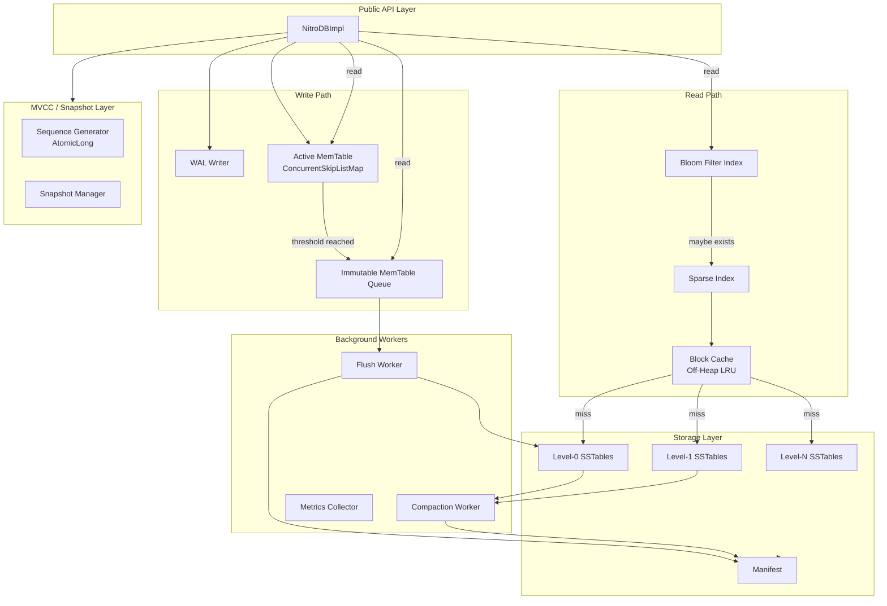

---

## 2.2 Data Flow Diagram

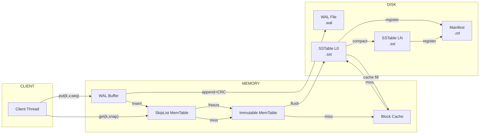

---

## 2.3 Write Path Diagram

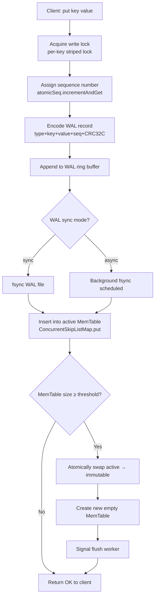

---

## 2.4 Read Path Diagram

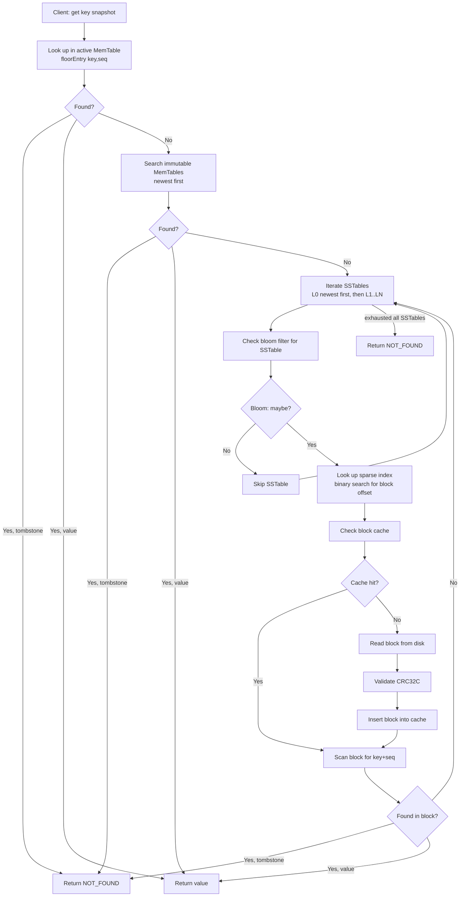

---

## 2.5 Recovery Path Diagram

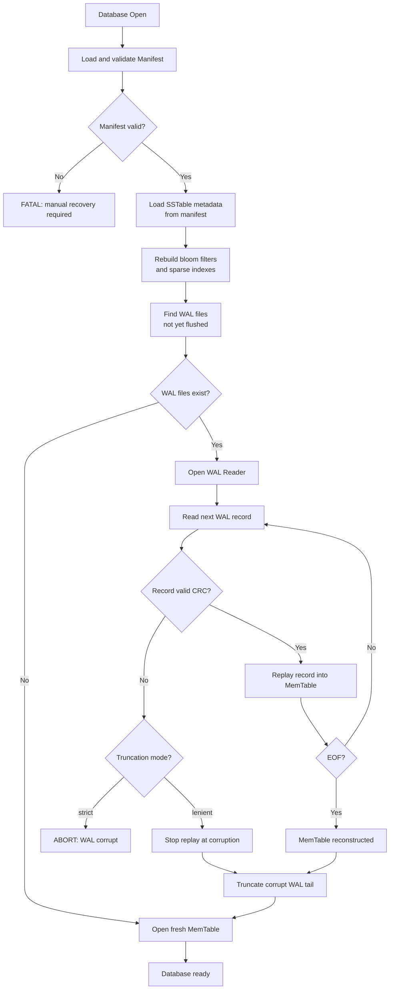

---

## 2.6 Compaction Path Diagram

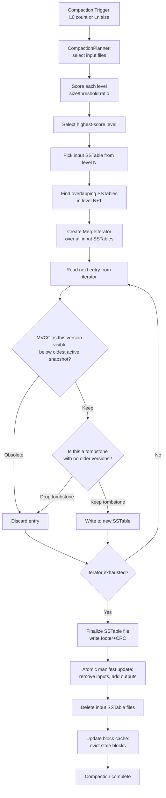

---

# SECTION 3 — EXECUTION FLOWCHARTS

## 3.1 Startup Flowchart

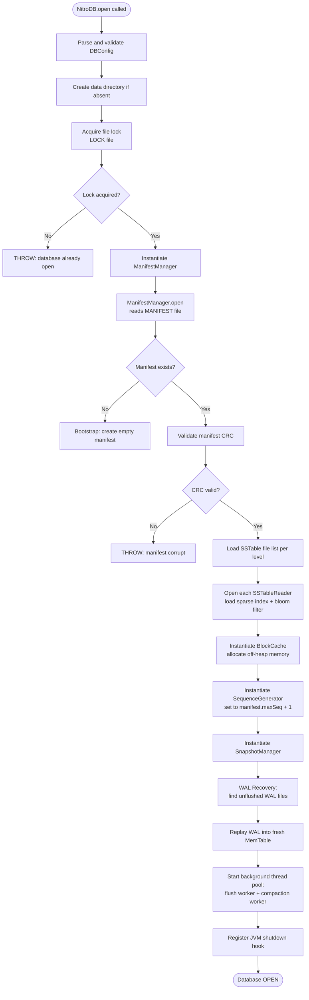

---

## 3.2 Shutdown Flowchart

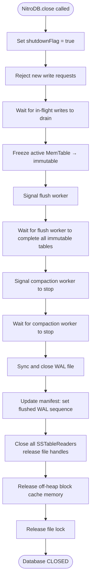

---

## 3.3 Put Flowchart

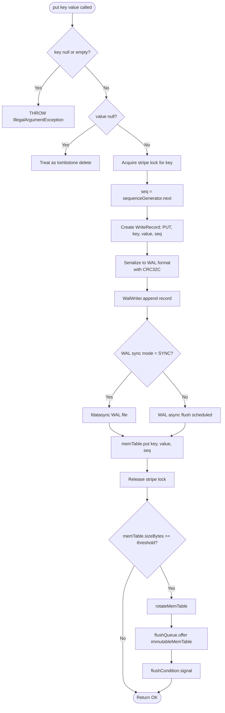

---

## 3.4 Get Flowchart

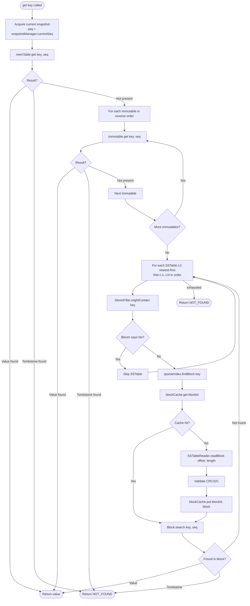

---

## 3.5 Delete Flowchart

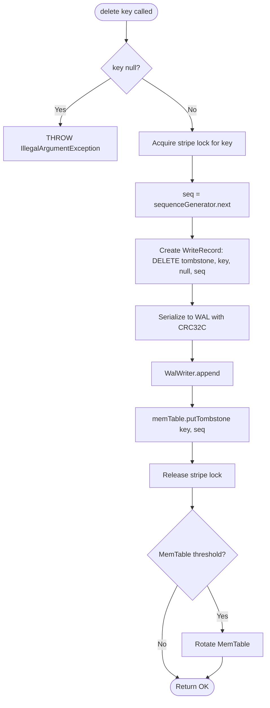

---

## 3.6 Range Scan Flowchart

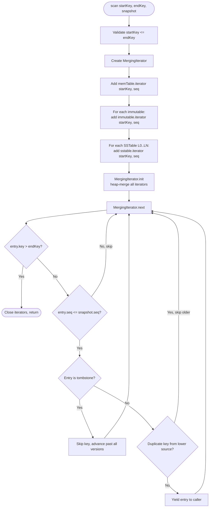

---

## 3.7 Snapshot Read Flowchart

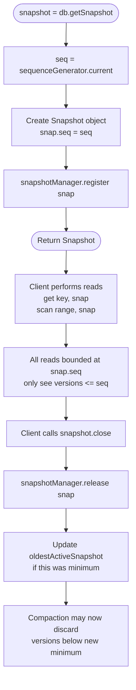

---

## 3.8 WAL Write Flowchart

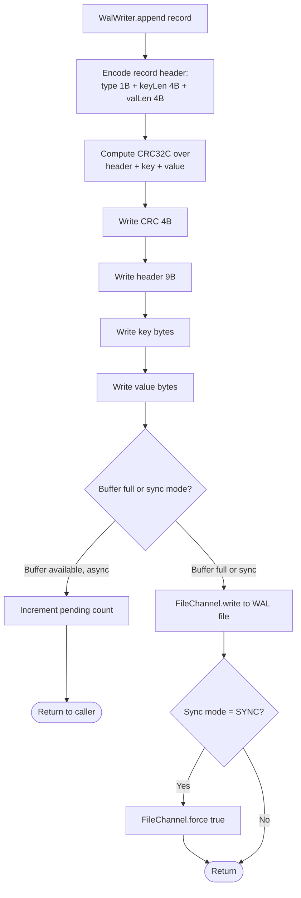

---

## 3.9 WAL Replay Flowchart

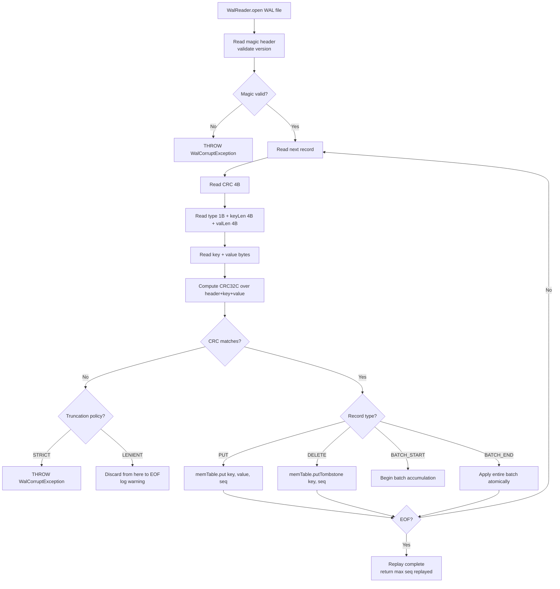

---

## 3.10 MemTable Flush Flowchart

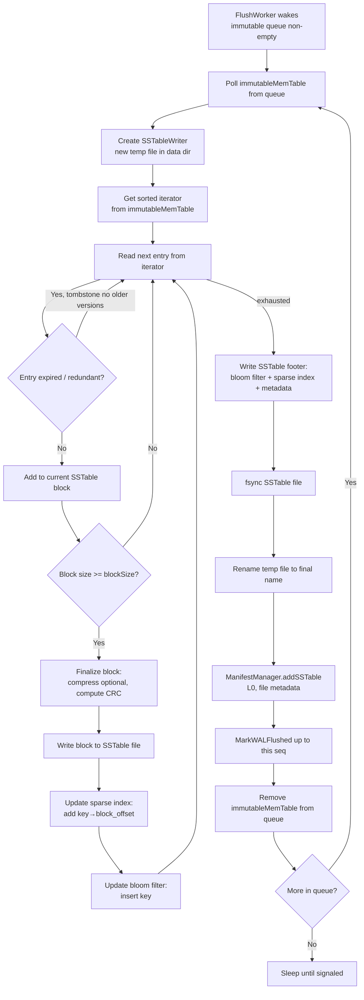

---

## 3.11 SSTable Creation Flowchart

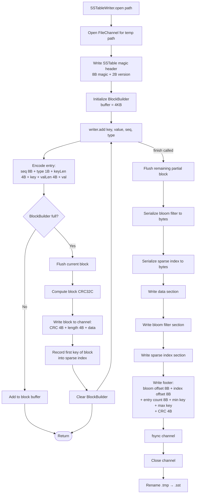

---

## 3.12 Compaction Flowchart

*(See Section 2.6 — detailed expansion below)*

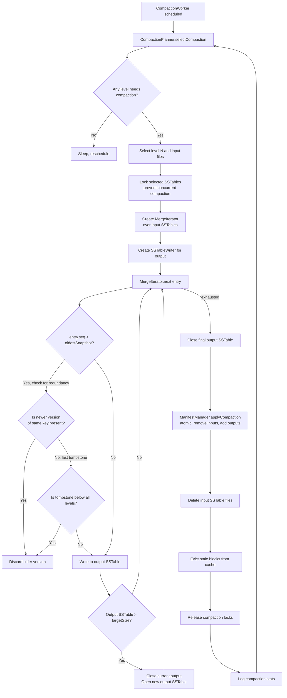

---

## 3.13 Recovery Flowchart

*(Expanded from Section 2.5)*

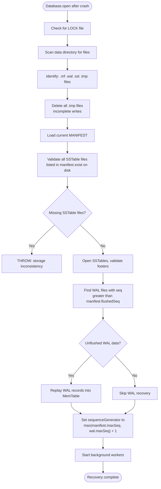

---

## 3.14 Cache Lookup Flowchart

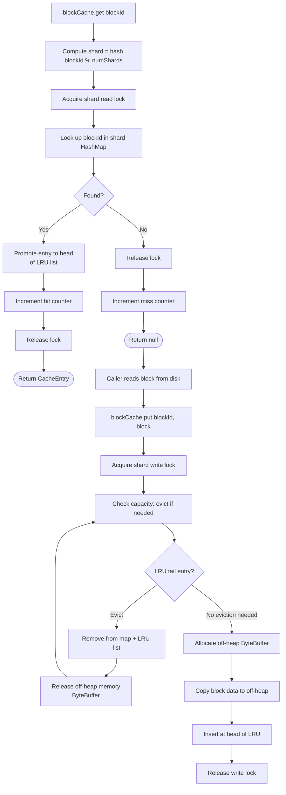

---

## 3.15 Bloom Filter Lookup Flowchart

```mermaid
flowchart TD
    A[bloomFilter.mightContain key] --> B[Compute hash1 using\nMurmur3 seed=0]
    B --> C[Compute hash2 using\nMurmur3 seed=hash1]
    C --> D[Initialize i = 0]
    D --> E[bitPos = abs hash1 + i*hash2 mod m]
    E --> F{bitArray.get bitPos?}
    F -- 0 = not set --> G([Return FALSE\ndefinitely not present])
    F -- 1 = set --> H[i++]
    H --> I{i < k probes?}
    I -- Yes --> E
    I -- No --> J([Return TRUE\nprobably present])
```

---

# SECTION 4 — SEQUENCE DIAGRAMS

## 4.1 Database Startup

```mermaid
sequenceDiagram
    participant App
    participant NitroDB
    participant ManifestManager
    participant SSTableRegistry
    participant WalRecovery
    participant MemTable
    participant ThreadPool

    App->>NitroDB: NitroDB.open(config)
    NitroDB->>NitroDB: acquireFileLock()
    NitroDB->>ManifestManager: open(dataDir)
    ManifestManager-->>NitroDB: manifest (levels, sequences)
    NitroDB->>SSTableRegistry: loadFromManifest(manifest)
    SSTableRegistry->>SSTableRegistry: openSSTables(), buildIndexes()
    SSTableRegistry-->>NitroDB: registry ready
    NitroDB->>WalRecovery: replayUnflushedWAL(manifest.flushedSeq)
    WalRecovery->>MemTable: put/delete per WAL record
    WalRecovery-->>NitroDB: maxSeqReplayed
    NitroDB->>ThreadPool: start(flushWorker, compactionWorker)
    ThreadPool-->>NitroDB: workers running
    NitroDB-->>App: NitroDB instance
```

---

## 4.2 Successful Write

```mermaid
sequenceDiagram
    participant Client
    participant NitroDB
    participant WalWriter
    participant MemTable
    participant FlushQueue

    Client->>NitroDB: put("user:1", data)
    NitroDB->>NitroDB: seq = seqGen.next()
    NitroDB->>WalWriter: append(PUT, key, value, seq)
    WalWriter->>WalWriter: encode + CRC32C
    WalWriter-->>NitroDB: OK (persisted)
    NitroDB->>MemTable: put(key, value, seq)
    MemTable-->>NitroDB: OK
    NitroDB->>NitroDB: checkMemTableThreshold()
    alt MemTable full
        NitroDB->>MemTable: freeze() → ImmutableMemTable
        NitroDB->>FlushQueue: offer(immutable)
        NitroDB->>NitroDB: createNewActiveMemTable()
    end
    NitroDB-->>Client: OK
```

---

## 4.3 Successful Read

```mermaid
sequenceDiagram
    participant Client
    participant NitroDB
    participant MemTable
    participant ImmutableMemTable
    participant BloomFilter
    participant BlockCache
    participant SSTableReader

    Client->>NitroDB: get("user:1")
    NitroDB->>NitroDB: snap = currentSeq()
    NitroDB->>MemTable: get("user:1", snap)
    MemTable-->>NitroDB: MISS
    NitroDB->>ImmutableMemTable: get("user:1", snap)
    ImmutableMemTable-->>NitroDB: MISS
    loop Each SSTable L0..LN
        NitroDB->>BloomFilter: mightContain("user:1")
        BloomFilter-->>NitroDB: true
        NitroDB->>NitroDB: sparseIndex.findBlockOffset("user:1")
        NitroDB->>BlockCache: get(blockId)
        BlockCache-->>NitroDB: MISS
        NitroDB->>SSTableReader: readBlock(offset, len)
        SSTableReader-->>NitroDB: block bytes
        NitroDB->>BlockCache: put(blockId, block)
        NitroDB->>NitroDB: block.search("user:1", snap)
        NitroDB-->>Client: value found
    end
```

---

## 4.4 Snapshot Read

```mermaid
sequenceDiagram
    participant Client
    participant NitroDB
    participant SnapshotManager
    participant MemTable
    participant SSTableReader

    Client->>NitroDB: snap = getSnapshot()
    NitroDB->>SnapshotManager: createSnapshot(currentSeq)
    SnapshotManager-->>Client: Snapshot(seq=1042)

    Note over Client: Writer concurrently puts seq=1043, 1044

    Client->>NitroDB: get("key", snap)
    NitroDB->>MemTable: get("key", seq=1042)
    Note over MemTable: Returns version at seq≤1042\nIgnores seq=1043,1044
    MemTable-->>Client: value at seq=1042

    Client->>NitroDB: snap.close()
    NitroDB->>SnapshotManager: release(snap)
    SnapshotManager->>SnapshotManager: updateOldestSnapshot()
```

---

## 4.5 Flush Cycle

```mermaid
sequenceDiagram
    participant FlushWorker
    participant FlushQueue
    participant ImmutableMemTable
    participant SSTableWriter
    participant ManifestManager
    participant WalManager

    FlushWorker->>FlushQueue: poll() [blocking]
    FlushQueue-->>FlushWorker: ImmutableMemTable
    FlushWorker->>SSTableWriter: open(tempPath)
    FlushWorker->>ImmutableMemTable: iterator()
    loop Each entry
        FlushWorker->>SSTableWriter: add(key, value, seq, type)
    end
    FlushWorker->>SSTableWriter: finish()
    SSTableWriter->>SSTableWriter: writeBlocks + bloomFilter + sparseIndex + footer
    SSTableWriter->>SSTableWriter: fsync + rename .tmp → .sst
    SSTableWriter-->>FlushWorker: SSTableMetadata
    FlushWorker->>ManifestManager: addSSTable(L0, metadata)
    ManifestManager-->>FlushWorker: OK
    FlushWorker->>WalManager: markFlushed(immutable.maxSeq)
    WalManager->>WalManager: deleteObsoleteWALSegments()
```

---

## 4.6 Compaction Cycle

```mermaid
sequenceDiagram
    participant CompactionWorker
    participant CompactionPlanner
    participant MergeIterator
    participant SSTableReader
    participant SSTableWriter
    participant ManifestManager

    CompactionWorker->>CompactionPlanner: selectCompaction(levels)
    CompactionPlanner-->>CompactionWorker: CompactionJob(levelN, inputFiles)
    CompactionWorker->>SSTableReader: openAll(inputFiles)
    CompactionWorker->>MergeIterator: create(readers)
    CompactionWorker->>SSTableWriter: open(outputTempPath)
    loop Merge loop
        CompactionWorker->>MergeIterator: next()
        MergeIterator-->>CompactionWorker: entry
        CompactionWorker->>CompactionWorker: applyMVCCFilter(entry)
        alt Keep entry
            CompactionWorker->>SSTableWriter: add(entry)
        end
    end
    CompactionWorker->>SSTableWriter: finish()
    SSTableWorker-->>CompactionWorker: outputMetadata
    CompactionWorker->>ManifestManager: applyCompaction(remove=inputs, add=outputs)
    ManifestManager-->>CompactionWorker: OK
    CompactionWorker->>CompactionWorker: deleteInputFiles()
```

---

## 4.7 Crash Recovery

```mermaid
sequenceDiagram
    participant App
    participant NitroDB
    participant ManifestManager
    participant WalReader
    participant MemTable
    participant SSTableRegistry

    Note over App,NitroDB: Process crashed, now restarting

    App->>NitroDB: NitroDB.open(config)
    NitroDB->>NitroDB: deleteTempFiles()
    NitroDB->>ManifestManager: open()
    ManifestManager->>ManifestManager: validateCRC + loadLevels
    ManifestManager-->>NitroDB: manifest (flushedSeq=900)
    NitroDB->>SSTableRegistry: load(manifest)
    SSTableRegistry-->>NitroDB: SSTables registered
    NitroDB->>WalReader: open(walFiles where seq > 900)
    loop Each WAL record
        WalReader->>WalReader: read + validateCRC
        WalReader->>MemTable: apply(record)
    end
    WalReader-->>NitroDB: maxSeqReplayed=1007
    NitroDB->>NitroDB: seqGen.set(1008)
    NitroDB-->>App: recovered NitroDB instance
    Note over App: All writes seq 901..1007 restored
```

---

# SECTION 5 — REPOSITORY STRUCTURE

```
nitrodb/
├── .github/
│   ├── workflows/
│   │   ├── ci.yml                        # Main CI: compile + unit tests
│   │   ├── integration-tests.yml         # Integration + stress tests
│   │   └── benchmarks.yml                # JMH benchmark pipeline
│   ├── ISSUE_TEMPLATE/
│   │   ├── bug_report.md
│   │   └── feature_request.md
│   └── PULL_REQUEST_TEMPLATE.md
│
├── benchmarks/
│   ├── src/
│   │   └── main/java/com/nitrodb/bench/
│   │       ├── ReadBenchmark.java         # JMH: point read throughput
│   │       ├── WriteBenchmark.java        # JMH: write throughput and latency
│   │       ├── MixedWorkloadBenchmark.java# JMH: 80/20 read-write mix
│   │       ├── CompactionBenchmark.java   # JMH: compaction speed
│   │       ├── RecoveryBenchmark.java     # JMH: WAL recovery speed
│   │       ├── BloomFilterBenchmark.java  # JMH: bloom filter ops
│   │       ├── BlockCacheBenchmark.java   # JMH: cache hit/miss rates
│   │       └── BenchmarkRunner.java       # Entry point, profile configs
│   └── pom.xml                            # Benchmarks module POM
│
├── config/
│   ├── default.properties                 # Default DBConfig values
│   ├── high-throughput.properties         # Tuned for write-heavy
│   ├── low-latency.properties             # Tuned for read latency
│   └── dev.properties                     # Development / testing config
│
├── docker/
│   ├── Dockerfile                         # Multi-stage build image
│   ├── docker-compose.yml                 # Dev environment
│   └── scripts/
│       ├── entrypoint.sh                  # Container entrypoint
│       └── healthcheck.sh                 # Container health probe
│
├── docs/
│   ├── README.md                          # Project overview and quickstart
│   ├── ARCHITECTURE.md                    # Full architecture description
│   ├── STORAGE_FORMAT.md                  # Binary file format specs
│   ├── MVCC.md                            # MVCC and snapshot isolation
│   ├── COMPACTION.md                      # Compaction strategy docs
│   ├── CONTRIBUTING.md                    # Contribution guidelines
│   ├── BENCHMARKS.md                      # Benchmark results and guide
│   ├── RECOVERY.md                        # Crash recovery procedures
│   ├── CONFIGURATION.md                   # All config parameters
│   └── diagrams/
│       ├── architecture-overview.png
│       ├── write-path.png
│       ├── read-path.png
│       └── compaction-levels.png
│
├── scripts/
│   ├── build.sh                           # Clean + full build
│   ├── test.sh                            # Run all tests
│   ├── benchmark.sh                       # Run JMH benchmarks
│   ├── stress.sh                          # Run JCStress tests
│   ├── checkstyle.sh                      # Run style checks
│   └── coverage.sh                        # Generate coverage report
│
├── src/
│   ├── main/
│   │   └── java/
│   │       └── com/nitrodb/
│   │           ├── NitroDB.java               # Public API interface
│   │           ├── NitroDBImpl.java            # Main implementation
│   │           ├── NitroDBBuilder.java         # Builder for construction
│   │           ├── DBConfig.java               # Configuration record
│   │           │
│   │           ├── api/
│   │           │   ├── WriteOptions.java       # Per-write options (sync, etc.)
│   │           │   ├── ReadOptions.java        # Per-read options (snapshot)
│   │           │   ├── ScanResult.java         # Lazy scan result
│   │           │   ├── Entry.java              # Key-value entry record
│   │           │   └── DBException.java        # Typed exceptions hierarchy
│   │           │
│   │           ├── wal/
│   │           │   ├── WalWriter.java          # Append WAL records
│   │           │   ├── WalReader.java          # Replay WAL records
│   │           │   ├── WalRecord.java          # WAL record data structure
│   │           │   ├── WalSegment.java         # Single WAL file abstraction
│   │           │   ├── WalManager.java         # Lifecycle + rotation
│   │           │   └── WalConstants.java       # Magic bytes, version constants
│   │           │
│   │           ├── memtable/
│   │           │   ├── MemTable.java           # Active concurrent skip-list memtable
│   │           │   ├── ImmutableMemTable.java  # Frozen snapshot for flushing
│   │           │   ├── MemTableEntry.java      # Entry: key, value, seq, type
│   │           │   ├── MemTableIterator.java   # Sorted iterator over entries
│   │           │   └── MemTableStats.java      # Size / count tracking
│   │           │
│   │           ├── sstable/
│   │           │   ├── SSTableWriter.java      # Write SSTable files
│   │           │   ├── SSTableReader.java      # Read blocks from SSTable
│   │           │   ├── SSTableMetadata.java    # File metadata record
│   │           │   ├── SSTableIterator.java    # Sequential scan iterator
│   │           │   ├── BlockBuilder.java       # Build individual data blocks
│   │           │   ├── Block.java              # Decoded block + search
│   │           │   ├── BlockHandle.java        # Offset + length reference
│   │           │   ├── SSTableFooter.java      # Footer decode/encode
│   │           │   └── SSTableConstants.java   # File magic, version, limits
│   │           │
│   │           ├── index/
│   │           │   ├── SparseIndex.java        # In-memory key→block-offset index
│   │           │   ├── SparseIndexEntry.java   # Single index entry record
│   │           │   └── SparseIndexBuilder.java # Builds index during SSTable write
│   │           │
│   │           ├── bloom/
│   │           │   ├── BloomFilter.java        # Bloom filter with Murmur3
│   │           │   ├── BloomFilterBuilder.java # Build filter during flush
│   │           │   └── BloomFilterSerializer.java # Serialize/deserialize to bytes
│   │           │
│   │           ├── cache/
│   │           │   ├── BlockCache.java         # Sharded LRU block cache
│   │           │   ├── CacheShard.java         # Single LRU shard
│   │           │   ├── CacheEntry.java         # Cached block + off-heap ref
│   │           │   ├── CacheKey.java           # SSTable ID + block offset
│   │           │   └── OffHeapAllocator.java   # ByteBuffer.allocateDirect pool
│   │           │
│   │           ├── mvcc/
│   │           │   ├── SequenceGenerator.java  # Monotonic AtomicLong sequence
│   │           │   ├── Snapshot.java           # Snapshot handle + seq number
│   │           │   ├── SnapshotManager.java    # Track active snapshots
│   │           │   └── VersionedKey.java       # Composite key: userKey + seq
│   │           │
│   │           ├── compaction/
│   │           │   ├── CompactionWorker.java   # Background compaction thread
│   │           │   ├── CompactionPlanner.java  # Select which files to compact
│   │           │   ├── CompactionJob.java      # Input/output file set
│   │           │   ├── MergeIterator.java      # Heap-merge across iterators
│   │           │   ├── LeveledCompactionStrategy.java # Leveled scoring
│   │           │   └── CompactionStats.java    # Bytes read/written/elapsed
│   │           │
│   │           ├── manifest/
│   │           │   ├── ManifestManager.java    # Load, update, persist manifest
│   │           │   ├── ManifestRecord.java     # Append-only log record
│   │           │   ├── ManifestEntry.java      # SSTable add/remove event
│   │           │   ├── LevelMetadata.java      # Per-level SSTable list
│   │           │   └── ManifestConstants.java  # Magic, version, limits
│   │           │
│   │           ├── recovery/
│   │           │   ├── RecoveryManager.java    # Orchestrate full recovery
│   │           │   ├── WalRecovery.java        # WAL-specific replay logic
│   │           │   └── ConsistencyChecker.java # Verify SSTable + manifest sync
│   │           │
│   │           ├── io/
│   │           │   ├── FileManager.java        # File creation, rename, delete
│   │           │   ├── ByteBufferInputStream.java # Wrap ByteBuffer as stream
│   │           │   └── ChecksumUtil.java       # CRC32C computation helpers
│   │           │
│   │           ├── iter/
│   │           │   ├── InternalIterator.java   # Base iterator interface
│   │           │   ├── MergingIterator.java    # N-way merge for scans
│   │           │   └── IteratorUtils.java      # Skip tombstones, dedup keys
│   │           │
│   │           ├── serialization/
│   │           │   ├── KeyEncoder.java         # Encode/decode user keys
│   │           │   ├── ValueEncoder.java       # Encode/decode values
│   │           │   ├── RecordEncoder.java      # Full record encoding
│   │           │   └── BinaryFormat.java       # Byte-level format constants
│   │           │
│   │           ├── flush/
│   │           │   ├── FlushWorker.java        # Drain immutable queue → SSTable
│   │           │   └── FlushStats.java         # Flush timing + byte metrics
│   │           │
│   │           └── metrics/
│   │               ├── NitroDBMetrics.java     # Central metrics registry
│   │               ├── CounterMetric.java      # Monotonic counter
│   │               ├── GaugeMetric.java        # Point-in-time gauge
│   │               ├── HistogramMetric.java    # Latency histogram (HdrHistogram)
│   │               └── MetricsReporter.java    # Log/export metrics periodically
│   │
│   └── test/
│       └── java/
│           └── com/nitrodb/
│               ├── NitroDBIntegrationTest.java
│               ├── NitroDBConcurrentTest.java
│               │
│               ├── wal/
│               │   ├── WalWriterTest.java
│               │   ├── WalReaderTest.java
│               │   └── WalRecoveryTest.java
│               │
│               ├── memtable/
│               │   ├── MemTableTest.java
│               │   ├── ImmutableMemTableTest.java
│               │   └── MemTableIteratorTest.java
│               │
│               ├── sstable/
│               │   ├── SSTableWriterTest.java
│               │   ├── SSTableReaderTest.java
│               │   ├── BlockBuilderTest.java
│               │   └── SSTableIteratorTest.java
│               │
│               ├── index/
│               │   └── SparseIndexTest.java
│               │
│               ├── bloom/
│               │   ├── BloomFilterTest.java
│               │   └── BloomFilterSerializerTest.java
│               │
│               ├── cache/
│               │   ├── BlockCacheTest.java
│               │   ├── CacheShardTest.java
│               │   └── OffHeapAllocatorTest.java
│               │
│               ├── mvcc/
│               │   ├── SequenceGeneratorTest.java
│               │   ├── SnapshotTest.java
│               │   └── SnapshotManagerTest.java
│               │
│               ├── compaction/
│               │   ├── CompactionPlannerTest.java
│               │   ├── MergeIteratorTest.java
│               │   └── LeveledCompactionTest.java
│               │
│               ├── manifest/
│               │   ├── ManifestManagerTest.java
│               │   └── ManifestRecoveryTest.java
│               │
│               ├── recovery/
│               │   ├── RecoveryManagerTest.java
│               │   └── CrashRecoveryTest.java
│               │
│               ├── stress/
│               │   ├── ConcurrentWriteReadStressTest.java    # JCStress
│               │   ├── SnapshotIsolationStressTest.java      # JCStress
│               │   └── CompactionRaceStressTest.java         # JCStress
│               │
│               └── util/
│                   ├── ChecksumUtilTest.java
│                   └── TestUtils.java            # Shared test helpers
│
├── .editorconfig                  # Code style: indent, charset, line endings
├── .gitignore                     # Java + Maven + IDE ignores
├── CHANGELOG.md                   # Version history
├── LICENSE                        # Apache 2.0
├── README.md                      # Top-level project README
└── pom.xml                        # Root Maven POM
```
# SECTION 6 — JAVA PACKAGE STRUCTURE

## 6.1 Complete Package Tree

```
com.nitrodb                          Root — public API entry points
│
├── api                              Public-facing types and options
├── wal                              Write-Ahead Log subsystem
├── memtable                         In-memory write buffer
├── sstable                          On-disk sorted string table files
├── index                            Sparse index for SSTable block lookup
├── bloom                            Probabilistic key presence filters
├── cache                            Off-heap block cache
├── mvcc                             Versioning and snapshot management
├── compaction                       Background merge and level management
├── manifest                         Persistent metadata and version state
├── recovery                         Startup recovery orchestration
├── flush                            MemTable → SSTable background worker
├── io                               File I/O utilities and checksums
├── iter                             Iterator abstractions for scans
├── serialization                    Binary encoding/decoding
└── metrics                          Instrumentation and observability
```

---

## 6.2 Package Responsibilities

### `com.nitrodb` (root)
The root package contains only the public-facing surface area: the `NitroDB` interface, the `NitroDBImpl` entry point, the `NitroDBBuilder`, and `DBConfig`. Nothing in this package depends on internal packages being exposed. This is the only package users import.

### `com.nitrodb.api`
Contains value types used across the public API: `WriteOptions` (sync/async mode, TTL), `ReadOptions` (snapshot reference, verify checksums), `Entry` (a key-value pair returned from scans), `ScanResult` (a lazy Iterable/AutoCloseable over scan results), and `DBException` (a hierarchy of typed storage exceptions including `CorruptionException`, `IOStorageException`, and `SnapshotExpiredException`). No business logic lives here.

### `com.nitrodb.wal`
Encapsulates everything related to the Write-Ahead Log. `WalWriter` appends encoded records. `WalReader` replays them during recovery. `WalSegment` models a single WAL file and its lifecycle (open, active, sealed, deleted). `WalManager` owns segment rotation when a segment reaches its size limit. `WalRecord` is the internal data class for a single log entry. `WalConstants` holds magic bytes and version markers used in binary encoding.

### `com.nitrodb.memtable`
Manages in-memory write buffers. `MemTable` is a thread-safe, concurrent skip-list backed buffer. `ImmutableMemTable` is a frozen, read-only snapshot created when the active table exceeds its size threshold. `MemTableEntry` is the internal versioned record. `MemTableIterator` provides a sorted, snapshot-bounded view. `MemTableStats` tracks live size in bytes and entry count.

### `com.nitrodb.sstable`
Manages on-disk SSTable files. `SSTableWriter` builds a new SSTable from a sorted stream, writing data blocks, bloom filter, sparse index, and footer. `SSTableReader` opens an existing SSTable, decodes its footer, and serves block reads. `BlockBuilder` accumulates key-value entries into a fixed-size block. `Block` is the decoded in-memory representation of a data block with a binary search method. `BlockHandle` is a simple offset+length pair. `SSTableFooter` encodes/decodes the footer section. `SSTableMetadata` records the file path, level, min/max keys, and file size. `SSTableIterator` provides a sequential scan from a starting key.

### `com.nitrodb.index`
Contains the sparse index used to locate which block in an SSTable might contain a given key. `SparseIndex` stores an array of `SparseIndexEntry` (firstKey → blockOffset) and implements binary search. `SparseIndexBuilder` accumulates entries during SSTable creation. The index is stored in the SSTable footer and loaded entirely into heap memory at open time.

### `com.nitrodb.bloom`
Implements a space-efficient probabilistic filter using double-hashing with Murmur3. `BloomFilter` is the core bit array structure with `add` and `mightContain` operations. `BloomFilterBuilder` accumulates keys during SSTable creation and produces a `BloomFilter`. `BloomFilterSerializer` handles binary serialization to/from a byte array embedded in the SSTable footer. False positive rate is configurable (default: 1%).

### `com.nitrodb.cache`
Implements an off-heap, sharded LRU block cache. `BlockCache` shards the cache across N independent `CacheShard` instances (default: 16) to reduce lock contention. Each `CacheShard` is an LRU map of `CacheKey → CacheEntry`. `CacheEntry` holds a reference to a `ByteBuffer.allocateDirect` region. `OffHeapAllocator` provides a simple allocate/free interface over direct ByteBuffers. All cache memory is accounted for and bounded by a configured maximum size.

### `com.nitrodb.mvcc`
Provides multi-version concurrency control. `SequenceGenerator` is a single `AtomicLong` that issues monotonically increasing sequence numbers to writes. `Snapshot` is an immutable handle capturing a sequence number at a point in time. `SnapshotManager` tracks all active snapshots, computes the minimum active sequence number (used by compaction to determine which versions are safe to GC), and handles snapshot creation and release. `VersionedKey` is the internal composite key encoding (userKey + sequenceNumber) used in MemTable and SSTable.

### `com.nitrodb.compaction`
Orchestrates background merging of SSTables. `CompactionWorker` is the background thread that periodically checks for compaction triggers. `CompactionPlanner` scores each level and selects the input files for compaction. `CompactionJob` is an immutable record of the selected input and planned output files. `MergeIterator` performs a k-way merge across multiple SSTable iterators using a min-heap. `LeveledCompactionStrategy` implements the level scoring and input selection algorithms. `CompactionStats` records bytes read, bytes written, and elapsed time per compaction run.

### `com.nitrodb.manifest`
Maintains the persistent metadata file that records which SSTables exist at which levels. `ManifestManager` reads the manifest on startup, applies incremental `ManifestRecord` entries (SSTable add, SSTable remove, WAL flushed sequence), and rewrites the manifest after compaction. `ManifestRecord` is a single append-only log entry. `ManifestEntry` is an individual SSTable addition or removal event. `LevelMetadata` holds the ordered list of SSTable metadata for a single level. All manifest updates are CRC-validated.

### `com.nitrodb.recovery`
High-level orchestration for crash recovery. `RecoveryManager` is called by `NitroDBImpl.open()` and performs the full recovery sequence: load manifest, verify on-disk SSTables, replay WAL, advance sequence generator. `WalRecovery` contains the WAL-specific replay loop. `ConsistencyChecker` verifies that every SSTable listed in the manifest actually exists on disk and vice versa, and that SSTable footers are valid.

### `com.nitrodb.flush`
Background flush of immutable MemTables to Level-0 SSTables. `FlushWorker` is a dedicated thread that blocks on the immutable queue, pops an `ImmutableMemTable`, drives `SSTableWriter`, then notifies `ManifestManager`. `FlushStats` tracks flush latency and bytes written.

### `com.nitrodb.io`
Low-level file and I/O utilities. `FileManager` provides atomic file operations (create temp, rename, delete). `ByteBufferInputStream` wraps a `ByteBuffer` as a standard `InputStream`. `ChecksumUtil` provides a fast CRC32C computation via `java.util.zip.CRC32C`.

### `com.nitrodb.iter`
Iterator abstractions used for range scans. `InternalIterator` defines the common interface (`hasNext`, `next`, `seek`, `close`). `MergingIterator` performs an N-way merge across a list of `InternalIterator` instances using a `PriorityQueue`. `IteratorUtils` provides helpers for deduplicating versioned keys and skipping tombstones during user-visible scans.

### `com.nitrodb.serialization`
Custom binary encoding for keys, values, and full records. No Java serialization is used anywhere. `KeyEncoder` handles length-prefixed key bytes. `ValueEncoder` handles value bytes with type tag. `RecordEncoder` assembles the full binary record (seq + type + key + value) for both WAL and SSTable use. `BinaryFormat` defines all byte offsets and field sizes as named constants.

### `com.nitrodb.metrics`
Instrumentation layer. `NitroDBMetrics` is a central registry holding all metric instances. `CounterMetric` wraps a `LongAdder` for high-concurrency increment. `GaugeMetric` holds a `Supplier<Long>` for current values. `HistogramMetric` uses HdrHistogram for latency tracking. `MetricsReporter` logs a formatted snapshot of all metrics every N seconds (configurable).

---

# SECTION 7 — CLASS INVENTORY

## 7.1 Root Package

### `NitroDB` (interface)
- **Package:** `com.nitrodb`
- **Responsibility:** The only public-facing interface. Defines all operations a user can perform against the database.
- **Dependencies:** `api.*`
- **Public methods:**
  - `void put(byte[] key, byte[] value)`
  - `void put(byte[] key, byte[] value, WriteOptions opts)`
  - `Optional<byte[]> get(byte[] key)`
  - `Optional<byte[]> get(byte[] key, ReadOptions opts)`
  - `void delete(byte[] key)`
  - `ScanResult scan(byte[] startKey, byte[] endKey)`
  - `ScanResult scan(byte[] startKey, byte[] endKey, ReadOptions opts)`
  - `Snapshot getSnapshot()`
  - `void close()`
- **Thread safety:** All methods must be safe for concurrent invocation.

---

### `NitroDBImpl`
- **Package:** `com.nitrodb`
- **Responsibility:** Central coordinator. Implements `NitroDB`. Owns all subsystem references and lifecycle. Routes operations to correct subsystems.
- **Dependencies:** All subsystem packages
- **Public methods:** All from `NitroDB` interface
- **Internal methods:**
  - `rotateMemTable()` — freeze active, enqueue immutable
  - `searchSSTables(byte[] key, long seq)` — level-by-level SSTable lookup
  - `checkMemTableThreshold()` — trigger rotation if size exceeded
  - `acquireStripeLock(byte[] key)` — hash-based stripe locking
- **Thread safety:** Uses striped locks for writes; reads are concurrent with no global lock.

---

### `NitroDBBuilder`
- **Package:** `com.nitrodb`
- **Responsibility:** Fluent builder for constructing a `NitroDB` instance with validated configuration.
- **Dependencies:** `DBConfig`, `NitroDBImpl`
- **Public methods:**
  - `NitroDBBuilder dataDir(Path dir)`
  - `NitroDBBuilder memTableSize(long bytes)`
  - `NitroDBBuilder blockCacheSize(long bytes)`
  - `NitroDBBuilder bloomFalsePositiveRate(double rate)`
  - `NitroDBBuilder syncWrites(boolean sync)`
  - `NitroDB build()`
- **Thread safety:** Not thread-safe; used at construction time only.

---

### `DBConfig`
- **Package:** `com.nitrodb`
- **Responsibility:** Immutable configuration record for all tunable parameters.
- **Dependencies:** None
- **Fields (all final):** `dataDir`, `memTableSizeBytes`, `blockCacheSizeBytes`, `blockSizeBytes`, `maxLevels`, `levelSizeMultiplier`, `l1MaxBytes`, `bloomFalsePositiveRate`, `syncWrites`, `walSyncMode`, `compactionIntervalMs`, `maxImmutableCount`, `targetSSTableSizeBytes`, `walSegmentSizeBytes`, `numCacheShards`, `checksumVerification`
- **Thread safety:** Immutable record.

---

## 7.2 `api` Package

### `WriteOptions`
- **Responsibility:** Per-write configuration. Sync mode override. Future: TTL.
- **Fields:** `syncMode` (SYNC/ASYNC), `ttlMs` (optional)
- **Thread safety:** Immutable.

### `ReadOptions`
- **Responsibility:** Per-read configuration. Snapshot reference.
- **Fields:** `snapshot` (optional), `verifyChecksums` (boolean)
- **Thread safety:** Immutable.

### `Entry`
- **Responsibility:** A single key-value pair returned from scans.
- **Fields:** `byte[] key`, `byte[] value`, `long sequenceNumber`
- **Thread safety:** Immutable.

### `ScanResult`
- **Responsibility:** Lazy, closeable iterator over a range scan. Implements `Iterable<Entry>` and `AutoCloseable`.
- **Dependencies:** `iter.MergingIterator`
- **Public methods:** `iterator()`, `close()`
- **Thread safety:** Not thread-safe; single-consumer use only.

### `DBException` hierarchy
- `DBException extends RuntimeException` — base
  - `CorruptionException` — checksum failure or data corruption
  - `IOStorageException` — file system errors
  - `SnapshotExpiredException` — snapshot used after release
  - `DatabaseLockException` — database already open
  - `RecoveryException` — unrecoverable crash state

---

## 7.3 `wal` Package

### `WalWriter`
- **Responsibility:** Encodes and appends `WalRecord` instances to the active WAL segment. Handles fsync on demand.
- **Dependencies:** `WalSegment`, `ChecksumUtil`, `RecordEncoder`
- **Public methods:**
  - `void append(WalRecord record)`
  - `void sync()`
  - `void close()`
- **Internal methods:**
  - `encodeRecord(WalRecord)` → `byte[]`
  - `flushBuffer()`
- **Thread safety:** Thread-safe. Internal writes guarded by a `ReentrantLock`.

### `WalReader`
- **Responsibility:** Reads WAL segments sequentially, decodes records, validates checksums, and returns them for replay.
- **Dependencies:** `WalSegment`, `ChecksumUtil`, `RecordEncoder`
- **Public methods:**
  - `Optional<WalRecord> readNext()`
  - `boolean hasNext()`
  - `void close()`
- **Internal methods:**
  - `decodeRecord(ByteBuffer)` → `WalRecord`
  - `validateCRC(header, body, storedCRC)` → `boolean`
- **Thread safety:** Single-threaded use (recovery only).

### `WalRecord`
- **Responsibility:** Data class for a single WAL entry.
- **Fields:** `RecordType type` (PUT/DELETE), `byte[] key`, `byte[] value` (nullable for DELETE), `long sequenceNumber`
- **Thread safety:** Immutable.

### `WalSegment`
- **Responsibility:** Wraps a single WAL file (`FileChannel`). Tracks file size for rotation detection.
- **Dependencies:** `FileManager`
- **Public methods:**
  - `void write(byte[] data)`
  - `void force(boolean metadata)`
  - `long size()`
  - `Path path()`
  - `void close()`
- **Thread safety:** Single writer (protected by `WalWriter`'s lock).

### `WalManager`
- **Responsibility:** Manages the lifecycle of WAL segments: creating new segments, rotating when full, and deleting segments whose contents have been flushed.
- **Dependencies:** `WalSegment`, `ManifestManager`
- **Public methods:**
  - `WalSegment activeSegment()`
  - `void rotateSegment()`
  - `void markFlushed(long maxFlushedSeq)`
  - `List<Path> unflushedSegments(long flushedSeq)`
- **Thread safety:** Thread-safe. Protected by internal `ReentrantLock`.

### `WalConstants`
- **Fields:** `MAGIC = 0x4E4954524F574C` (bytes for "NITROWL"), `VERSION = 1`, `HEADER_SIZE = 9`, `CRC_SIZE = 4`

---

## 7.4 `memtable` Package

### `MemTable`
- **Responsibility:** Thread-safe, concurrent, in-memory write buffer backed by a `ConcurrentSkipListMap`. Stores versioned entries. Tracks total size in bytes.
- **Dependencies:** `MemTableEntry`, `VersionedKey`, `MemTableStats`
- **Public methods:**
  - `void put(byte[] key, byte[] value, long seq)`
  - `void putTombstone(byte[] key, long seq)`
  - `Optional<MemTableEntry> get(byte[] key, long maxSeq)`
  - `MemTableIterator iterator(byte[] fromKey, long maxSeq)`
  - `ImmutableMemTable freeze()`
  - `long sizeBytes()`
  - `long entryCount()`
- **Internal methods:**
  - `estimateEntrySize(key, value)` → `long`
- **Thread safety:** Fully concurrent. `ConcurrentSkipListMap` handles internal concurrency. `sizeBytes` uses `LongAdder`.

### `ImmutableMemTable`
- **Responsibility:** A frozen, read-only view of a `MemTable` created during rotation. Used exclusively by the `FlushWorker`.
- **Dependencies:** `MemTable`, `MemTableIterator`
- **Public methods:**
  - `Optional<MemTableEntry> get(byte[] key, long maxSeq)`
  - `MemTableIterator iterator()`
  - `long sizeBytes()`
  - `long minSeq()`
  - `long maxSeq()`
- **Thread safety:** Immutable after construction. Reads are concurrent.

### `MemTableEntry`
- **Fields:** `byte[] key`, `byte[] value` (null = tombstone), `long sequenceNumber`, `EntryType type` (PUT/DELETE)
- **Thread safety:** Immutable.

### `MemTableIterator`
- **Responsibility:** Iterates over `ConcurrentSkipListMap` entries in key order, respecting the snapshot sequence bound. Implements `InternalIterator`.
- **Dependencies:** `MemTableEntry`, `VersionedKey`
- **Public methods:** `seek`, `hasNext`, `next`, `close`
- **Thread safety:** Not thread-safe; single-consumer only.

### `MemTableStats`
- **Responsibility:** Atomic tracking of byte count and entry count for a `MemTable`.
- **Fields:** `LongAdder sizeBytes`, `LongAdder entryCount`
- **Thread safety:** Fully thread-safe via `LongAdder`.

---

## 7.5 `sstable` Package

### `SSTableWriter`
- **Responsibility:** Creates a new SSTable file from a sorted stream of entries. Manages blocks, bloom filter, sparse index, and footer. Writes to a temp file and renames on finish.
- **Dependencies:** `BlockBuilder`, `BloomFilterBuilder`, `SparseIndexBuilder`, `SSTableFooter`, `ChecksumUtil`, `FileManager`
- **Public methods:**
  - `static SSTableWriter open(Path dir, int level, DBConfig config)`
  - `void add(byte[] key, byte[] value, long seq, EntryType type)`
  - `SSTableMetadata finish()`
- **Internal methods:**
  - `flushBlock()` — finalize and write current block
  - `writeFooter()` — serialize bloom + index + footer
- **Thread safety:** Single-threaded use (FlushWorker or CompactionWorker).

### `SSTableReader`
- **Responsibility:** Opens an existing SSTable file, reads footer to load sparse index and bloom filter, and serves block reads.
- **Dependencies:** `SSTableFooter`, `SparseIndex`, `BloomFilter`, `Block`, `BlockHandle`, `ChecksumUtil`
- **Public methods:**
  - `static SSTableReader open(Path path, DBConfig config)`
  - `Optional<byte[]> get(byte[] key, long maxSeq)`
  - `Block readBlock(BlockHandle handle)`
  - `SSTableIterator iterator(byte[] fromKey, long maxSeq)`
  - `BloomFilter bloomFilter()`
  - `SparseIndex sparseIndex()`
  - `SSTableMetadata metadata()`
  - `void close()`
- **Internal methods:**
  - `decodeFooter()` — read last N bytes, parse footer
  - `loadSparseIndex(long offset, int length)` — deserialize
  - `loadBloomFilter(long offset, int length)` — deserialize
- **Thread safety:** Thread-safe after open. `FileChannel.read(ByteBuffer, position)` is position-independent.

### `SSTableMetadata`
- **Fields:** `Path filePath`, `int level`, `long fileSize`, `byte[] minKey`, `byte[] maxKey`, `long entryCount`, `long minSeq`, `long maxSeq`, `long bloomOffset`, `long indexOffset`, `String fileId` (UUID-based)
- **Thread safety:** Immutable record.

### `SSTableIterator`
- **Responsibility:** Sequential scan from a start key through an SSTable, block by block.
- **Dependencies:** `SSTableReader`, `Block`, `SparseIndex`
- **Public methods:** `seek`, `hasNext`, `next`, `close`
- **Thread safety:** Not thread-safe; single-consumer only.

### `BlockBuilder`
- **Responsibility:** Accumulates key-value entries into a single data block of fixed target size. Encodes them in a flat binary layout.
- **Dependencies:** `RecordEncoder`
- **Public methods:**
  - `void add(byte[] key, byte[] value, long seq, EntryType type)`
  - `boolean isFull()`
  - `byte[] finish()`
  - `byte[] firstKey()`
  - `void reset()`
- **Thread safety:** Single-threaded.

### `Block`
- **Responsibility:** Decoded in-memory representation of a data block. Provides binary search for a key+seq lookup.
- **Dependencies:** `RecordEncoder`, `MemTableEntry`
- **Public methods:**
  - `static Block decode(byte[] data)`
  - `Optional<MemTableEntry> search(byte[] key, long maxSeq)`
  - `List<MemTableEntry> entries()`
- **Thread safety:** Immutable after decode; thread-safe for reads.

### `BlockHandle`
- **Fields:** `long offset`, `int length`
- **Thread safety:** Immutable.

### `SSTableFooter`
- **Responsibility:** Encodes and decodes the SSTable footer (last 64+ bytes of file).
- **Fields:** `long bloomFilterOffset`, `int bloomFilterLength`, `long sparseIndexOffset`, `int sparseIndexLength`, `long entryCount`, `byte[] minKey`, `byte[] maxKey`, `int crc`
- **Public methods:**
  - `static SSTableFooter decode(ByteBuffer buf)`
  - `byte[] encode()`
- **Thread safety:** Immutable after construction.

### `SSTableConstants`
- **Fields:** `MAGIC = 0x4E4954524F5353` ("NITROSS"), `VERSION = 1`, `FOOTER_FIXED_SIZE = 64`, `BLOCK_MAGIC = 0xBD`, `MAX_BLOCK_SIZE = 1024 * 1024`

---

## 7.6 `index` Package

### `SparseIndex`
- **Responsibility:** An in-memory sorted array of `(firstKey, blockOffset, blockLength)` tuples. Binary search finds the block that may contain a target key.
- **Dependencies:** `SparseIndexEntry`, `BlockHandle`
- **Public methods:**
  - `BlockHandle findBlock(byte[] key)`
  - `int size()`
  - `byte[] firstKey()`
  - `byte[] lastKey()`
- **Thread safety:** Immutable after construction; thread-safe for reads.

### `SparseIndexEntry`
- **Fields:** `byte[] firstKey`, `long blockOffset`, `int blockLength`
- **Thread safety:** Immutable.

### `SparseIndexBuilder`
- **Responsibility:** Accumulates `SparseIndexEntry` values as blocks are written, produces a `SparseIndex`.
- **Public methods:**
  - `void add(byte[] firstKey, long offset, int length)`
  - `SparseIndex build()`
  - `byte[] serialize()`
- **Thread safety:** Single-threaded.

---

## 7.7 `bloom` Package

### `BloomFilter`
- **Responsibility:** Space-efficient probabilistic filter. Uses double-hashing (Murmur3) to set/test k bit positions.
- **Dependencies:** None (uses Google Guava's `Hashing.murmur3_128` or inline implementation)
- **Fields:** `long[] bitArray`, `int numHashFunctions`, `int bitArraySize`
- **Public methods:**
  - `void add(byte[] key)`
  - `boolean mightContain(byte[] key)`
  - `double expectedFalsePositiveRate(long insertedKeys)`
- **Internal methods:**
  - `hash1(byte[] key)` → `long`
  - `hash2(byte[] key, long seed)` → `long`
  - `setBit(int position)`
  - `testBit(int position)` → `boolean`
- **Thread safety:** Not thread-safe during build; immutable and thread-safe after creation.

### `BloomFilterBuilder`
- **Responsibility:** Builds a `BloomFilter` of appropriate size given an expected key count and target false positive rate.
- **Public methods:**
  - `static BloomFilter build(int expectedKeys, double fpr)`
  - `void add(byte[] key)` (delegates to under-construction filter)
  - `BloomFilter finish()`

### `BloomFilterSerializer`
- **Responsibility:** Converts a `BloomFilter` to/from a compact byte array for storage in the SSTable footer.
- **Public methods:**
  - `byte[] serialize(BloomFilter filter)`
  - `BloomFilter deserialize(byte[] data)`

---

## 7.8 `cache` Package

### `BlockCache`
- **Responsibility:** Sharded, off-heap, thread-safe LRU cache keyed by `CacheKey`. Distributes load across `numShards` independent `CacheShard` instances.
- **Dependencies:** `CacheShard`, `CacheKey`, `CacheEntry`, `NitroDBMetrics`
- **Public methods:**
  - `Optional<ByteBuffer> get(CacheKey key)`
  - `void put(CacheKey key, ByteBuffer data)`
  - `void evict(CacheKey key)`
  - `void evictFile(String fileId)` — evict all blocks from a file (post-compaction)
  - `long sizeBytes()`
  - `void close()`
- **Internal methods:**
  - `shardFor(CacheKey key)` → `CacheShard`
- **Thread safety:** Thread-safe. Each shard has its own `ReentrantReadWriteLock`.

### `CacheShard`
- **Responsibility:** A single LRU shard backed by a `LinkedHashMap<CacheKey, CacheEntry>` with access-order iteration.
- **Dependencies:** `CacheKey`, `CacheEntry`, `OffHeapAllocator`
- **Public methods:**
  - `Optional<ByteBuffer> get(CacheKey key)`
  - `void put(CacheKey key, ByteBuffer data)`
  - `void evict(CacheKey key)`
  - `void evictWhere(Predicate<CacheKey>)`
- **Internal methods:**
  - `ensureCapacity(int needed)` — evict LRU entries until space available
- **Thread safety:** Protected by a `ReentrantReadWriteLock`.

### `CacheEntry`
- **Fields:** `CacheKey key`, `ByteBuffer offHeapData`, `int sizeBytes`, `long accessTime`
- **Thread safety:** Accessed under shard lock only.

### `CacheKey`
- **Fields:** `String fileId`, `long blockOffset`
- **Responsibility:** Value-type key for cache lookups. Implements `hashCode` and `equals` based on both fields.
- **Thread safety:** Immutable.

### `OffHeapAllocator`
- **Responsibility:** Provides a pool-aware interface for `ByteBuffer.allocateDirect`. Tracks total allocated bytes.
- **Public methods:**
  - `ByteBuffer allocate(int size)`
  - `void release(ByteBuffer buffer)`
  - `long totalAllocatedBytes()`
- **Thread safety:** Thread-safe. Uses `AtomicLong` for accounting.

---

## 7.9 `mvcc` Package

### `SequenceGenerator`
- **Responsibility:** Issues monotonically increasing sequence numbers to all write operations. Single global source of truth for ordering.
- **Dependencies:** None
- **Public methods:**
  - `long next()` — fetch-and-increment
  - `long current()` — peek without incrementing
  - `void setMinimum(long minValue)` — used during recovery
- **Thread safety:** Backed by `AtomicLong`. Fully lock-free.

### `Snapshot`
- **Responsibility:** An immutable handle capturing the sequence number at the time of `getSnapshot()`. Implements `AutoCloseable`.
- **Fields:** `long sequenceNumber`, `long createdAt`
- **Public methods:**
  - `long sequenceNumber()`
  - `void close()` — releases snapshot from `SnapshotManager`
- **Thread safety:** Immutable after construction.

### `SnapshotManager`
- **Responsibility:** Tracks all currently active `Snapshot` instances. Computes and exposes the minimum active sequence number for compaction's MVCC filter.
- **Dependencies:** `Snapshot`, `SequenceGenerator`
- **Public methods:**
  - `Snapshot create(long seq)`
  - `void release(Snapshot snap)`
  - `long oldestActiveSequence()` — minimum seq across active snapshots
  - `int activeSnapshotCount()`
- **Internal methods:**
  - `updateMinimum()` — recalculate after release
- **Thread safety:** Thread-safe. Uses `CopyOnWriteArrayList` or `ConcurrentSkipListSet` for snapshot tracking.

### `VersionedKey`
- **Responsibility:** Composite key combining a user key and a sequence number. Defines the total ordering used by the skip list: primary sort by key bytes ascending, secondary sort by sequence number descending (newest first).
- **Fields:** `byte[] userKey`, `long sequenceNumber`
- **Implements:** `Comparable<VersionedKey>`
- **Thread safety:** Immutable.

---

## 7.10 `compaction` Package

### `CompactionWorker`
- **Responsibility:** Background `Thread` that periodically invokes `CompactionPlanner`, executes `CompactionJob`s, and notifies `ManifestManager`.
- **Dependencies:** `CompactionPlanner`, `ManifestManager`, `SSTableReader`, `SSTableWriter`, `MergeIterator`, `BlockCache`, `SnapshotManager`
- **Public methods:**
  - `void start()`
  - `void stop()`
  - `void triggerNow()` — for testing
- **Thread safety:** Runs in its own thread. Notifies manifest under its own lock.

### `CompactionPlanner`
- **Responsibility:** Scores each level and selects the optimal input SSTable(s) for the next compaction. Implements leveled compaction scoring.
- **Dependencies:** `LevelMetadata`, `LeveledCompactionStrategy`, `DBConfig`
- **Public methods:**
  - `Optional<CompactionJob> selectCompaction(List<LevelMetadata> levels)`
- **Internal methods:**
  - `scoreLevel(LevelMetadata, DBConfig)` → `double`
  - `selectInputFile(LevelMetadata level)` → `SSTableMetadata`
  - `findOverlappingFiles(SSTableMetadata input, LevelMetadata targetLevel)` → `List<SSTableMetadata>`

### `CompactionJob`
- **Fields:** `int sourceLevel`, `List<SSTableMetadata> sourceFiles`, `int targetLevel`, `List<SSTableMetadata> targetFiles` (overlapping), `long minSeqForGC`
- **Thread safety:** Immutable.

### `MergeIterator`
- **Responsibility:** Performs a k-way merge over a list of `InternalIterator`s using a min-heap (`PriorityQueue`). Deduplicates entries with the same key by returning only the highest sequence number.
- **Dependencies:** `InternalIterator`, `MemTableEntry`
- **Public methods:** Implements `InternalIterator` (`seek`, `hasNext`, `next`, `close`)
- **Thread safety:** Not thread-safe; single consumer.

### `LeveledCompactionStrategy`
- **Responsibility:** Encapsulates leveled compaction scoring rules: L0 triggers on file count, L1+ trigger on total bytes vs target.
- **Public methods:**
  - `double score(int level, LevelMetadata metadata, DBConfig config)`
  - `boolean needsCompaction(int level, LevelMetadata metadata, DBConfig config)`
  - `long targetBytesForLevel(int level, DBConfig config)`

### `CompactionStats`
- **Fields:** `long bytesRead`, `long bytesWritten`, `long durationMs`, `int filesIn`, `int filesOut`, `int levelFrom`, `int levelTo`
- **Thread safety:** Immutable after construction.

---

## 7.11 `manifest` Package

### `ManifestManager`
- **Responsibility:** Persistent, CRC-validated log of all SSTable additions and removals. Loaded on startup. Updated atomically on flush and compaction.
- **Dependencies:** `ManifestRecord`, `ManifestEntry`, `LevelMetadata`, `ChecksumUtil`, `FileManager`
- **Public methods:**
  - `void open(Path dataDir)`
  - `LevelMetadata getLevel(int level)`
  - `List<SSTableMetadata> getAllSSTables()`
  - `long getFlushedSequence()`
  - `void addSSTable(int level, SSTableMetadata meta)`
  - `void applyCompaction(List<SSTableMetadata> remove, List<SSTableMetadata> add)`
  - `void setFlushedSequence(long seq)`
  - `void close()`
- **Internal methods:**
  - `writeRecord(ManifestRecord)` — append to file with CRC
  - `rebuildState()` — replay all records to reconstruct level map
  - `rewrite()` — compact manifest after threshold
- **Thread safety:** Thread-safe. Protected by `ReentrantLock`.

### `ManifestRecord`
- **Responsibility:** A single append-only log entry in the manifest file.
- **Fields:** `ManifestRecordType type` (ADD_SSTABLE, REMOVE_SSTABLE, SET_FLUSHED_SEQ), `ManifestEntry payload`, `int crc`
- **Thread safety:** Immutable.

### `ManifestEntry`
- **Fields:** `int level`, `SSTableMetadata metadata` (for ADD/REMOVE records), `long sequence` (for SET_FLUSHED_SEQ)
- **Thread safety:** Immutable.

### `LevelMetadata`
- **Responsibility:** Ordered list of SSTableMetadata for a single level, with helper methods for key range queries.
- **Public methods:**
  - `List<SSTableMetadata> files()`
  - `List<SSTableMetadata> overlapping(byte[] minKey, byte[] maxKey)`
  - `long totalBytes()`
  - `int fileCount()`
- **Thread safety:** Protected by `ManifestManager`'s lock when modified; read-only snapshot returned to consumers.

### `ManifestConstants`
- **Fields:** `MAGIC = 0x4E4954524F4D46` ("NITROMF"), `VERSION = 1`, `RECORD_HEADER_SIZE = 5`

---

## 7.12 `recovery` Package

### `RecoveryManager`
- **Responsibility:** Orchestrates the full recovery sequence on startup: consistency check → SSTable loading → WAL replay → sequence restoration.
- **Dependencies:** `ManifestManager`, `ConsistencyChecker`, `WalRecovery`, `SequenceGenerator`, `MemTable`
- **Public methods:**
  - `RecoveryResult recover(Path dataDir, DBConfig config)`
- **Thread safety:** Called once at startup; not concurrent.

### `WalRecovery`
- **Responsibility:** Replays WAL records into a MemTable, handling CRC failures per configured truncation policy.
- **Dependencies:** `WalReader`, `WalManager`, `MemTable`, `DBConfig`
- **Public methods:**
  - `long replay(List<Path> walFiles, MemTable target, long fromSeq)`
- **Thread safety:** Single-threaded.

### `ConsistencyChecker`
- **Responsibility:** Verifies all SSTable files in manifest exist on disk; validates SSTable footers; reports and optionally removes orphan files.
- **Dependencies:** `ManifestManager`, `SSTableReader`
- **Public methods:**
  - `ConsistencyReport check(Path dataDir, ManifestManager manifest)`
- **Thread safety:** Single-threaded.

---

## 7.13 `flush` Package

### `FlushWorker`
- **Responsibility:** Dedicated background thread. Blocks on the immutable MemTable queue, drains each table to a Level-0 SSTable, and notifies the manifest.
- **Dependencies:** `ImmutableMemTable`, `SSTableWriter`, `ManifestManager`, `WalManager`, `FlushStats`, `NitroDBMetrics`
- **Public methods:**
  - `void start()`
  - `void stop()`
  - `void awaitIdle()` — for testing/shutdown
- **Internal methods:**
  - `flushOne(ImmutableMemTable)` → `SSTableMetadata`
- **Thread safety:** Runs in dedicated thread. Queue is a `LinkedBlockingQueue`.

### `FlushStats`
- **Fields:** `long bytesWritten`, `long durationMs`, `long entriesFlushed`
- **Thread safety:** Immutable after construction.

---

## 7.14 `io` Package

### `FileManager`
- **Responsibility:** Abstracts all filesystem interactions: create, rename, delete, list, lock. Provides temp-file-then-rename pattern for atomic writes.
- **Public methods:**
  - `Path createTempFile(Path dir, String prefix, String suffix)`
  - `void atomicRename(Path src, Path dst)`
  - `void deleteFile(Path path)`
  - `List<Path> listFiles(Path dir, String extension)`
  - `FileLock acquireLock(Path lockFile)`
- **Thread safety:** All methods are thread-safe (filesystem operations are atomic at OS level).

### `ByteBufferInputStream`
- **Responsibility:** Wraps a `ByteBuffer` as an `InputStream` for compatibility with code expecting stream input.
- **Thread safety:** Not thread-safe; single-consumer.

### `ChecksumUtil`
- **Responsibility:** CRC32C computation over byte arrays and `ByteBuffer` regions. Uses Java 9+ `java.util.zip.CRC32C`.
- **Public methods:**
  - `int compute(byte[] data)` → `int`
  - `int compute(ByteBuffer buf, int offset, int length)` → `int`
  - `void validate(byte[] data, int expected)` — throws `CorruptionException` on mismatch
- **Thread safety:** Stateless utility class; fully thread-safe.

---

## 7.15 `iter` Package

### `InternalIterator` (interface)
- **Purpose:** Common interface for all iterators in the system (MemTable, SSTable, MergeIterator).
- **Methods:**
  - `void seek(byte[] key, long maxSeq)`
  - `boolean hasNext()`
  - `MemTableEntry next()`
  - `void close()`

### `MergingIterator`
- **Responsibility:** N-way merge using a `PriorityQueue<HeapEntry>` where each heap entry holds the current `MemTableEntry` from one source iterator.
- **Dependencies:** `InternalIterator`, `MemTableEntry`
- **Public methods:** Implements `InternalIterator`
- **Internal:** `HeapEntry` record comparing `VersionedKey` ordering
- **Thread safety:** Not thread-safe.

### `IteratorUtils`
- **Responsibility:** Static helpers: skip tombstone entries, deduplicate versioned keys (return only highest seq for user key), apply snapshot filter.
- **Public methods:**
  - `static InternalIterator skippingTombstones(InternalIterator iter)`
  - `static InternalIterator deduplicating(InternalIterator iter)`
  - `static InternalIterator snapshotBounded(InternalIterator iter, long maxSeq)`
- **Thread safety:** Wraps iterators; not independently thread-safe.

---

## 7.16 `serialization` Package

### `KeyEncoder`
- **Responsibility:** Encode/decode user keys as length-prefixed byte arrays. Format: `[4B length][N bytes key]`
- **Public methods:**
  - `void encode(byte[] key, ByteBuffer buf)`
  - `byte[] decode(ByteBuffer buf)`
  - `int encodedSize(byte[] key)`

### `ValueEncoder`
- **Responsibility:** Encode/decode values with type byte. Format: `[1B type][4B length][N bytes value]`
- **Public methods:**
  - `void encode(byte[] value, EntryType type, ByteBuffer buf)`
  - `ValueDecodeResult decode(ByteBuffer buf)` — returns type + value

### `RecordEncoder`
- **Responsibility:** Full record binary format combining sequence, type, key, and value. Used in both WAL and SSTable blocks.
- **Format:** `[8B seq][1B type][4B keyLen][keyLen bytes][4B valLen][valLen bytes]`
- **Public methods:**
  - `void encode(MemTableEntry entry, ByteBuffer buf)`
  - `MemTableEntry decode(ByteBuffer buf)`
  - `int encodedSize(MemTableEntry entry)`

### `BinaryFormat`
- **Responsibility:** Named constants for all field sizes and offsets. Single source of truth for binary format.
- **Fields (all static final int):** `SEQ_OFFSET=0`, `SEQ_SIZE=8`, `TYPE_OFFSET=8`, `TYPE_SIZE=1`, `KEY_LEN_OFFSET=9`, `KEY_LEN_SIZE=4`, `KEY_DATA_OFFSET=13`, etc.

---

## 7.17 `metrics` Package

### `NitroDBMetrics`
- **Responsibility:** Central registry. Holds all named metrics. Exposes a snapshot map for external consumption.
- **Dependencies:** `CounterMetric`, `GaugeMetric`, `HistogramMetric`
- **Key metrics registered:**
  - `writes.total` (counter), `reads.total` (counter), `reads.hit.cache` (counter)
  - `writes.latency.us` (histogram), `reads.latency.us` (histogram)
  - `compaction.bytes.written` (counter), `compaction.runs` (counter)
  - `memtable.size.bytes` (gauge), `sstable.count.l0` (gauge)
  - `wal.bytes.written` (counter), `flush.runs` (counter)
- **Thread safety:** Thread-safe. Metrics are individually thread-safe.

### `CounterMetric`
- **Fields:** `String name`, `LongAdder value`
- **Public methods:** `increment()`, `increment(long delta)`, `get()`
- **Thread safety:** Thread-safe via `LongAdder`.

### `GaugeMetric`
- **Fields:** `String name`, `Supplier<Long> valueSupplier`
- **Public methods:** `get()` — invokes supplier
- **Thread safety:** Thread-safe if supplier is thread-safe.

### `HistogramMetric`
- **Fields:** `String name`, `Recorder recorder` (HdrHistogram), `Histogram histogram`
- **Public methods:** `record(long valueUs)`, `snapshot()` → `HistogramSnapshot`
- **Thread safety:** Thread-safe. Uses HdrHistogram's `Recorder` for concurrent updates.

### `MetricsReporter`
- **Responsibility:** Background thread that logs a formatted metrics snapshot every N seconds.
- **Dependencies:** `NitroDBMetrics`
- **Public methods:** `start()`, `stop()`
- **Thread safety:** Runs in dedicated thread.

---

# SECTION 8 — INTERFACES

## 8.1 `NitroDB` (Public API)
```
Purpose: Single entry point for all database operations.
Methods: put, get, delete, scan, getSnapshot, close
Implementations: NitroDBImpl
```

## 8.2 `InternalIterator`
```
Purpose: Uniform iteration contract for MemTable, SSTable, and merged iterators.
Methods: seek(byte[], long), hasNext(), next(), close()
Implementations: MemTableIterator, SSTableIterator, MergingIterator,
                 SkipTombstonesIterator (wrapper), DeduplicatingIterator (wrapper)
```

## 8.3 `CompactionStrategy`
```
Purpose: Pluggable interface for compaction scoring logic.
Methods:
  double score(int level, LevelMetadata meta, DBConfig config)
  boolean needsCompaction(int level, LevelMetadata meta, DBConfig config)
  Optional<CompactionJob> selectJob(List<LevelMetadata> levels, DBConfig config)
Implementations: LeveledCompactionStrategy
```

## 8.4 `Closeable` (standard Java)
```
Purpose: All resources implement AutoCloseable.
Implementations: NitroDB, SSTableReader, SSTableWriter, WalWriter,
                 WalReader, BlockCache, Snapshot, ScanResult, ManifestManager
```

## 8.5 `MetricsSink`
```
Purpose: Allows external metric exporters (Prometheus, JMX) to receive metric snapshots.
Methods:
  void onCounter(String name, long value)
  void onGauge(String name, long value)
  void onHistogram(String name, HistogramSnapshot snapshot)
Implementations: LoggingMetricsSink (built-in), custom by users
```

---

# SECTION 9 — IMPLEMENTATION SPECIFICATION

| File | Purpose | Inputs | Outputs | Key Dependencies |
|------|---------|--------|---------|-----------------|
| `NitroDB.java` | Public API interface | — | — | `api.*` |
| `NitroDBImpl.java` | Central coordinator, all subsystems | `DBConfig` | All public ops | All packages |
| `NitroDBBuilder.java` | Fluent config builder | Fluent calls | `NitroDB` instance | `DBConfig` |
| `DBConfig.java` | All tunable parameters | Constructor | Config record | None |
| `api/WriteOptions.java` | Per-write config | Builder/defaults | Immutable options | None |
| `api/ReadOptions.java` | Per-read config | Builder/defaults | Immutable options | `mvcc.Snapshot` |
| `api/Entry.java` | Key-value pair | byte[], byte[], seq | Immutable record | None |
| `api/ScanResult.java` | Lazy scan result | `MergingIterator` | `Iterable<Entry>` | `iter.*` |
| `api/DBException.java` | Exception hierarchy | message, cause | Exception types | None |
| `wal/WalWriter.java` | Append WAL records | `WalRecord`, `WalSegment` | Written bytes | `WalSegment`, `ChecksumUtil` |
| `wal/WalReader.java` | Decode WAL records | WAL file path | `Optional<WalRecord>` stream | `WalSegment`, `ChecksumUtil` |
| `wal/WalRecord.java` | WAL entry data class | type, key, val, seq | Immutable record | None |
| `wal/WalSegment.java` | Single WAL file I/O | Path | Byte I/O | `FileManager` |
| `wal/WalManager.java` | WAL lifecycle | `DBConfig`, `ManifestManager` | Active segment | `WalSegment` |
| `wal/WalConstants.java` | WAL binary constants | — | Constants | None |
| `memtable/MemTable.java` | Concurrent skip-list buffer | key, val, seq | Entries, iterator | `VersionedKey`, `MemTableEntry` |
| `memtable/ImmutableMemTable.java` | Frozen memtable | `MemTable` snapshot | Read-only entries | `MemTableEntry` |
| `memtable/MemTableEntry.java` | Entry record | key, val, seq, type | Immutable record | None |
| `memtable/MemTableIterator.java` | Sorted iteration | Start key, maxSeq | `InternalIterator` | `MemTableEntry` |
| `memtable/MemTableStats.java` | Size tracking | Increments | Long values | None |
| `sstable/SSTableWriter.java` | Write SSTable file | Sorted entries | `SSTableMetadata`, .sst file | `BlockBuilder`, `BloomFilterBuilder`, `SparseIndexBuilder` |
| `sstable/SSTableReader.java` | Read SSTable file | Path | Lookups, iterator | `Block`, `SparseIndex`, `BloomFilter` |
| `sstable/SSTableMetadata.java` | File metadata | File info | Metadata record | None |
| `sstable/SSTableIterator.java` | Sequential SSTable scan | Start key | `InternalIterator` | `SSTableReader`, `Block` |
| `sstable/BlockBuilder.java` | Build data blocks | Entries | Block bytes | `RecordEncoder` |
| `sstable/Block.java` | Decoded block | byte[] block data | Entry search | `RecordEncoder` |
| `sstable/BlockHandle.java` | Offset+length | Two longs | Immutable record | None |
| `sstable/SSTableFooter.java` | Footer encode/decode | ByteBuffer | Footer fields | `ChecksumUtil` |
| `sstable/SSTableConstants.java` | SSTable constants | — | Constants | None |
| `index/SparseIndex.java` | Key→block lookup | Sorted entries | `BlockHandle` | `SparseIndexEntry` |
| `index/SparseIndexEntry.java` | Index entry | key, offset, len | Immutable record | None |
| `index/SparseIndexBuilder.java` | Build sparse index | Block writes | `SparseIndex`, bytes | `SparseIndexEntry` |
| `bloom/BloomFilter.java` | Bloom filter ops | key bytes | mightContain bool | None |
| `bloom/BloomFilterBuilder.java` | Build bloom filter | Expected count, fpr | `BloomFilter` | `BloomFilter` |
| `bloom/BloomFilterSerializer.java` | Bloom serialization | `BloomFilter` | byte[] | `BloomFilter` |
| `cache/BlockCache.java` | Sharded LRU cache | `CacheKey`, bytes | `Optional<ByteBuffer>` | `CacheShard` |
| `cache/CacheShard.java` | Single LRU shard | `CacheKey`, bytes | `Optional<ByteBuffer>` | `OffHeapAllocator` |
| `cache/CacheEntry.java` | Cache entry record | key, ByteBuffer | Mutable entry | None |
| `cache/CacheKey.java` | Cache lookup key | fileId, offset | Hashable key | None |
| `cache/OffHeapAllocator.java` | Direct buffer pool | size | `ByteBuffer` | None |
| `mvcc/SequenceGenerator.java` | Monotonic seq numbers | — | `long` | None |
| `mvcc/Snapshot.java` | Snapshot handle | seq, `SnapshotManager` | AutoCloseable | `SnapshotManager` |
| `mvcc/SnapshotManager.java` | Track active snapshots | `Snapshot` ops | min active seq | `Snapshot` |
| `mvcc/VersionedKey.java` | Composite key type | user key, seq | Comparable key | None |
| `compaction/CompactionWorker.java` | Background compaction thread | All subsystems | Compacted SSTables | `CompactionPlanner`, `ManifestManager` |
| `compaction/CompactionPlanner.java` | Select compaction input | Level metadata | `CompactionJob` | `LeveledCompactionStrategy` |
| `compaction/CompactionJob.java` | Compaction parameters | Input/output files | Immutable plan | `SSTableMetadata` |
| `compaction/MergeIterator.java` | K-way merge | `InternalIterator` list | Merged `InternalIterator` | `InternalIterator` |
| `compaction/LeveledCompactionStrategy.java` | Leveled scoring | Level stats | Scores, jobs | `DBConfig` |
| `compaction/CompactionStats.java` | Compaction metrics | Post-run data | Stats record | None |
| `manifest/ManifestManager.java` | Persist level metadata | SSTable add/remove | Level state | `ManifestRecord` |
| `manifest/ManifestRecord.java` | Log entry | type, payload, crc | Immutable record | None |
| `manifest/ManifestEntry.java` | SSTable event | level, metadata | Immutable record | `SSTableMetadata` |
| `manifest/LevelMetadata.java` | Level file list | SSTable metadata | File list, ranges | `SSTableMetadata` |
| `manifest/ManifestConstants.java` | Manifest constants | — | Constants | None |
| `recovery/RecoveryManager.java` | Full recovery sequence | `DBConfig`, dataDir | `RecoveryResult` | `WalRecovery`, `ConsistencyChecker` |
| `recovery/WalRecovery.java` | WAL replay | WAL paths, `MemTable` | Max seq replayed | `WalReader` |
| `recovery/ConsistencyChecker.java` | Verify disk state | `ManifestManager`, dataDir | Report | `SSTableReader` |
| `flush/FlushWorker.java` | Flush immutable tables | `ImmutableMemTable` queue | Level-0 SSTables | `SSTableWriter`, `ManifestManager` |
| `flush/FlushStats.java` | Flush metrics | Post-flush data | Stats record | None |
| `io/FileManager.java` | File operations | Paths | Files | Java NIO |
| `io/ByteBufferInputStream.java` | ByteBuffer as stream | `ByteBuffer` | `InputStream` | None |
| `io/ChecksumUtil.java` | CRC32C computation | byte[] / ByteBuffer | int checksum | `java.util.zip.CRC32C` |
| `iter/InternalIterator.java` | Iterator interface | — | — | None |
| `iter/MergingIterator.java` | N-way merge | Iterator list | Merged stream | `InternalIterator` |
| `iter/IteratorUtils.java` | Iterator wrappers | `InternalIterator` | Wrapped iterators | `InternalIterator` |
| `serialization/KeyEncoder.java` | Key binary encoding | byte[] | ByteBuffer | `BinaryFormat` |
| `serialization/ValueEncoder.java` | Value binary encoding | byte[], type | ByteBuffer | `BinaryFormat` |
| `serialization/RecordEncoder.java` | Full record encoding | `MemTableEntry` | ByteBuffer | `KeyEncoder`, `ValueEncoder` |
| `serialization/BinaryFormat.java` | Field offset constants | — | Constants | None |
| `metrics/NitroDBMetrics.java` | Metrics registry | — | All metrics | All metric types |
| `metrics/CounterMetric.java` | Counter | name | Incrementable | None |
| `metrics/GaugeMetric.java` | Gauge | name, supplier | Current value | None |
| `metrics/HistogramMetric.java` | Latency histogram | name | Percentiles | HdrHistogram |
| `metrics/MetricsReporter.java` | Periodic log reporter | `NitroDBMetrics` | Log output | None |

---

# SECTION 10 — DATA STRUCTURES

## 10.1 MVCC Record Layout

Every entry stored internally carries a sequence number and type.

```
┌─────────────────────────────────────────────────────────────────┐
│                    Internal MVCC Record                          │
├──────────┬────────────┬─────────────┬────────────┬─────────────┤
│  seq     │  type      │  keyLen     │  key data  │  value      │
│  8 bytes │  1 byte    │  4 bytes    │  N bytes   │  M bytes    │
│  (long)  │  PUT=1     │  (int)      │            │  (omit for  │
│          │  DEL=2     │             │            │   tombstone)│
└──────────┴────────────┴─────────────┴────────────┴─────────────┘
Total variable length: 13 + keyLen + valueLen bytes
```

Type byte values: `1 = PUT`, `2 = DELETE (tombstone)`

---

## 10.2 VersionedKey (MemTable Sort Key)

The `ConcurrentSkipListMap` inside `MemTable` uses `VersionedKey` as the map key. Ordering rules:
1. Primary: user key bytes, lexicographic ascending.
2. Secondary: sequence number, **descending** (newest version first).

This ensures that for a given user key, iterating from the beginning yields the latest version first, making snapshot reads efficient.

```
┌─────────────────────────────────────────────────────────┐
│                    VersionedKey                          │
├────────────────────────────┬────────────────────────────┤
│       userKey bytes        │       sequenceNumber       │
│       (byte[])             │       (long, desc order)   │
└────────────────────────────┴────────────────────────────┘
compareTo: first compare key bytes; if equal, compare -seqA vs -seqB
```

---

## 10.3 Skip List MemTable Nodes

Java's `ConcurrentSkipListMap<VersionedKey, MemTableEntry>` handles the skip list internals. No custom skip list implementation is required. Each logical "node" is a map entry:

```
ConcurrentSkipListMap entry:
  key:   VersionedKey { userKey: byte[N], seq: long }
  value: MemTableEntry { key: byte[N], value: byte[M]|null, seq: long, type: PUT|DEL }
```

Approximate heap size per entry: `~200 bytes` for the map node overhead + 32 bytes header + key + value data.

---

## 10.4 SSTable Metadata (In-Memory)

```java
record SSTableMetadata(
    String  fileId,         // UUID-based, used as cache key prefix
    Path    filePath,       // Absolute path to .sst file
    int     level,          // 0, 1, 2 ... maxLevels-1
    long    fileSize,       // Total file size in bytes
    byte[]  minKey,         // First key in file
    byte[]  maxKey,         // Last key in file
    long    entryCount,     // Total entries including tombstones
    long    minSeq,         // Minimum sequence number in file
    long    maxSeq,         // Maximum sequence number in file
    long    bloomOffset,    // Byte offset of bloom filter in file
    int     bloomLength,    // Byte length of bloom filter
    long    sparseIdxOffset,// Byte offset of sparse index in file
    int     sparseIdxLength // Byte length of sparse index
)
```

---

## 10.5 Bloom Filter Memory Layout

```
BloomFilter (in memory):
  long[]  bitArray     // ceil(m / 64) longs, m = optimal bit count
  int     numHashFunctions  // k, optimal k = (m/n) * ln2
  int     bitArraySize      // m, in bits

Optimal sizing:
  m = -n * ln(p) / (ln2)^2    where n=expected keys, p=fpr
  k = round((m/n) * ln2)

Example: 1M keys, 1% fpr:
  m = 9,585,058 bits ≈ 1.15 MB
  k = 7 hash functions
```

---

## 10.6 Block Cache Entry

```
CacheEntry:
  CacheKey   key          // fileId (String) + blockOffset (long)
  ByteBuffer offHeapData  // Direct ByteBuffer pointing to off-heap memory
  int        sizeBytes    // For capacity accounting
  long       lastAccess   // System.nanoTime() for LRU ordering

Memory layout (off-heap):
  [CRC32C: 4B][block length: 4B][block data: N bytes]
  Total = 8 + N bytes per cached block
```

---

## 10.7 Manifest Record (Binary)

```
ManifestRecord on disk:
  [type: 1B][payload length: 4B][payload bytes: N bytes][CRC32C: 4B]

Payload for ADD_SSTABLE / REMOVE_SSTABLE:
  [level: 4B][fileId length: 4B][fileId bytes][filePath length: 4B][filePath bytes]
  [fileSize: 8B][minKeyLen: 4B][minKey bytes][maxKeyLen: 4B][maxKey bytes]
  [entryCount: 8B][minSeq: 8B][maxSeq: 8B][bloomOffset: 8B][bloomLength: 4B]
  [sparseIdxOffset: 8B][sparseIdxLength: 4B]

Payload for SET_FLUSHED_SEQ:
  [sequence: 8B]
```

---

## 10.8 WAL Record Memory Layout

```
WalRecord in memory:
  RecordType  type           // PUT or DELETE
  byte[]      key
  byte[]      value          // null for DELETE
  long        sequenceNumber

WalRecord on disk:
  [CRC32C: 4B][type: 1B][keyLen: 4B][valLen: 4B][key: N bytes][value: M bytes]
  Total header = 13B + N + M bytes
  valLen = 0 for DELETE records
```

---

# SECTION 11 — FILE FORMATS

## 11.1 WAL File Format

```
WAL File (.wal):
┌─────────────────────────────────────────────────────────────────────┐
│                         WAL Header (16 bytes)                        │
├─────────────┬─────────────┬────────────────────────────────────────┤
│  Magic      │  Version    │  Reserved                               │
│  8 bytes    │  2 bytes    │  6 bytes                                │
│  0x4E4954524F574C │ 0x0001 │  0x000000000000                       │
└─────────────┴─────────────┴────────────────────────────────────────┘
│                      WAL Records (variable)                          │
│  [Record 1][Record 2][Record 3]...                                   │
└─────────────────────────────────────────────────────────────────────┘

WAL Record Format:
┌──────────┬──────────┬──────────┬────────────────────────────────────┐
│  CRC32C  │  type    │  keyLen  │  valLen  │  key data  │  val data  │
│  4 bytes │  1 byte  │  4 bytes │  4 bytes │  N bytes   │  M bytes   │
│  offset 0│  offset 4│  offset 5│  offset 9│ offset 13  │ 13+N bytes │
└──────────┴──────────┴──────────┴────────────────────────────────────┘

CRC32C covers: type(1) + keyLen(4) + valLen(4) + key(N) + val(M)
type values: 0x01 = PUT, 0x02 = DELETE
valLen = 0 for DELETE records (no value bytes follow)

Validation rules:
- Magic must equal 0x4E4954524F574C
- Version must be 0x0001
- CRC32C must match recomputed value
- keyLen must be > 0 and <= 65535
- valLen must be >= 0 and <= 10*1024*1024 (10 MB max value)
```

---

## 11.2 SSTable File Format

```
SSTable File (.sst):
┌─────────────────────────────────────────────────────────────────────┐
│                       File Header (16 bytes)                         │
├─────────────┬────────────┬─────────────────────────────────────────┤
│  Magic      │  Version   │  Reserved                                │
│  8 bytes    │  2 bytes   │  6 bytes                                 │
└─────────────┴────────────┴─────────────────────────────────────────┘
│                      Data Blocks (variable)                          │
│  [Block 1][Block 2][Block 3]...                                      │
│                                                                      │
│  Each Data Block:                                                    │
│  ┌──────────┬────────────┬──────────────────────────────────────┐   │
│  │ CRC32C   │  length    │  block data                          │   │
│  │ 4 bytes  │  4 bytes   │  N bytes                             │   │
│  └──────────┴────────────┴──────────────────────────────────────┘   │
│                                                                      │
│  Block Data (sorted entries):                                        │
│  [entry1][entry2][entry3]...                                         │
│  Each entry: [seq:8B][type:1B][keyLen:4B][key][valLen:4B][val]      │
└─────────────────────────────────────────────────────────────────────┘
│                     Bloom Filter Section                             │
│  [bloom filter bytes: B bytes]                                       │
└─────────────────────────────────────────────────────────────────────┘
│                     Sparse Index Section                             │
│  [entry count: 4B]                                                   │
│  [keyLen:4B][key:N bytes][offset:8B][length:4B] × entry_count       │
└─────────────────────────────────────────────────────────────────────┘
│                         Footer (fixed: 72+ bytes)                    │
├────────────────────────────────────────────────────────────────────┤
│ bloomOffset    │ bloomLength    │ sparseIdxOffset │ sparseIdxLen   │
│ 8 bytes        │ 4 bytes        │ 8 bytes         │ 4 bytes        │
├────────────────┴────────────────┴─────────────────┴────────────────┤
│ entryCount     │ minKeyLen      │ minKey          │ maxKeyLen      │
│ 8 bytes        │ 4 bytes        │ variable        │ 4 bytes        │
├────────────────┴────────────────┴─────────────────┴────────────────┤
│ maxKey (variable bytes)                                              │
├──────────────────────────────────────────────────────────────────┤
│ footerCRC  │ MAGIC_FOOTER                                           │
│ 4 bytes    │ 8 bytes = 0x4E4954524F464F54 ("NITROFOT")             │
└────────────┴───────────────────────────────────────────────────────┘

Reading Algorithm:
1. Seek to last 8 bytes, verify MAGIC_FOOTER
2. Read backwards to reconstruct footer fields
3. Load bloom filter from bloomOffset..bloomOffset+bloomLength
4. Load sparse index from sparseIdxOffset..sparseIdxOffset+sparseIdxLen
5. Validate all CRC32C fields

Validation rules:
- Magic header = 0x4E4954524F5353 and version = 0x0001
- Footer magic = 0x4E4954524F464F54
- All block CRC32C values must match
- minKey must be <= maxKey
- entryCount must be > 0
- bloom and index offsets must be within file bounds
```

---

## 11.3 Manifest File Format

```
Manifest File (.mf):
┌─────────────────────────────────────────────────────────────────────┐
│                      Manifest Header (16 bytes)                      │
├─────────────┬────────────┬─────────────────────────────────────────┤
│  Magic      │  Version   │  Reserved                                │
│  8 bytes    │  2 bytes   │  6 bytes                                 │
│  0x4E4954524F4D46 │ 0x0001 │                                       │
└─────────────┴────────────┴─────────────────────────────────────────┘
│                      Manifest Records (append-only)                  │
│  [Record 1][Record 2][Record 3]...                                   │
└─────────────────────────────────────────────────────────────────────┘

Manifest Record Format:
┌──────────┬────────────┬──────────────────────────────────────────┐
│  type    │  payLen    │  payload bytes         │  CRC32C          │
│  1 byte  │  4 bytes   │  payLen bytes          │  4 bytes         │
│  offset 0│  offset 1  │  offset 5              │  5+payLen bytes  │
└──────────┴────────────┴──────────────────────────────────────────┘

type values:
  0x01 = ADD_SSTABLE
  0x02 = REMOVE_SSTABLE
  0x03 = SET_FLUSHED_SEQ
  0x04 = COMPACTION_START  (written before compaction begins, for recovery)
  0x05 = COMPACTION_END    (written after compaction completes)

CRC32C covers: type(1) + payLen(4) + payload(N bytes)

ADD_SSTABLE payload:
  [level:4B][fileIdLen:4B][fileId:N][pathLen:4B][path:N][fileSize:8B]
  [minKeyLen:4B][minKey:N][maxKeyLen:4B][maxKey:N][entryCount:8B]
  [minSeq:8B][maxSeq:8B][bloomOffset:8B][bloomLen:4B]
  [sparseIdxOffset:8B][sparseIdxLen:4B]

REMOVE_SSTABLE payload:
  [level:4B][fileIdLen:4B][fileId:N]

SET_FLUSHED_SEQ payload:
  [sequence:8B]

Recovery from incomplete compaction:
  If COMPACTION_START exists without COMPACTION_END:
    Remove all ADD_SSTABLE entries for files listed in COMPACTION_START
    Keep all input files listed in COMPACTION_START
    → compaction is re-run on next startup (idempotent)
```

---

# SECTION 12 — CONCURRENCY DESIGN

## 12.1 Thread Model

NitroDB uses the following threads:

| Thread | Count | Responsibility |
|--------|-------|---------------|
| Caller threads | N (unbounded) | Issue put/get/delete/scan operations |
| Flush Worker | 1 | Drain immutable MemTable queue to Level-0 SSTables |
| Compaction Worker | 1 | Background leveled compaction |
| Metrics Reporter | 1 | Periodic metrics logging |
| WAL Sync Worker | 1 (optional) | Async WAL fsync batching |

---

## 12.2 Synchronization Model

### Write Path Locking

Writes use **striped locking** — not a single global write lock — to allow concurrent writes to different keys while preventing concurrent writes to the same key from racing on sequence numbers.

```
StripedLock: 64 stripes (default), each is a ReentrantLock
stripe = hash(key) & 63
lock(stripe) → assign seq → write WAL → write memtable → unlock(stripe)
```

### MemTable Rotation

When a caller detects the memtable is full, it acquires a dedicated `rotationLock`:
- Only one thread performs the rotation.
- Other threads wait briefly then re-check. If rotation already happened (new active memtable is small), they proceed without rotating again.
- This prevents "thundering herd" on rotation.

### Read Path Locking

Reads acquire **no locks**. They use:
- `ConcurrentSkipListMap.floorEntry()` for memtable lookups.
- Snapshot sequence numbers for MVCC visibility.
- SSTable readers are immutable after open; `FileChannel.read(ByteBuffer, position)` is thread-safe.
- Block cache uses per-shard `ReentrantReadWriteLock`.

### Manifest Updates

All manifest mutations (addSSTable, removeSSTable, setFlushedSeq) are serialized through `ManifestManager`'s single `ReentrantLock`. The lock is held only during the append write. The in-memory level state is updated under the same lock.

---

## 12.3 Lock-Free Sections

| Section | Mechanism |
|---------|-----------|
| Sequence number generation | `AtomicLong.getAndIncrement()` |
| MemTable size tracking | `LongAdder` (no CAS loop) |
| Metrics counters | `LongAdder` |
| Cache hit/miss counters | `LongAdder` |
| Snapshot set (min tracking) | `AtomicLong` for min snapshot seq |
| SSTable list reads | Copy-on-write: readers see immutable list snapshots |

---

## 12.4 Atomic Operations

```java
// Sequence generation - fully lock-free
long seq = seqGen.next(); // AtomicLong.incrementAndGet()

// MemTable size tracking - no CAS loop needed
sizeTracker.add(entrySize); // LongAdder.add(delta)

// Snapshot minimum tracking - updated on release
minActiveSnapshot.updateAndGet(current -> 
    Math.min(current, computeNewMinimum()));

// Flush queue - blocking, no spin
immutableQueue.offer(immutable); // LinkedBlockingQueue
flushWorker.signal();            // Condition.signalAll()
```

---

## 12.5 Visibility Guarantees

- **WAL write before memtable write:** WAL append happens before memtable insert within the stripe lock. Any thread reading the memtable after the lock is released sees the write.
- **Immutable MemTable visibility:** The `freeze()` operation uses `ConcurrentSkipListMap`'s built-in memory ordering. The `flushQueue.offer()` is a happens-before relationship to the FlushWorker's `poll()`.
- **SSTable registration:** `ManifestManager.addSSTable()` holds a lock during both the file write and the in-memory list update. After the lock is released, all threads reading the level list see the new SSTable.
- **Compaction cleanup:** SSTable deletion only occurs after `ManifestManager.applyCompaction()` completes. BlockCache eviction of stale blocks follows immediately after. The deleted SSTableReaders are closed; any in-flight reads that already have a reference to the old reader complete safely.

---

## 12.6 Background Workers

### FlushWorker
```
State machine:
  IDLE → WAITING (blocking poll on LinkedBlockingQueue)
  WAITING → FLUSHING (got ImmutableMemTable)
  FLUSHING → IDLE (completed, queue may be non-empty)

Shutdown:
  shutdownFlag=true → interrupt thread → drain remaining queue → exit
```

### CompactionWorker
```
State machine:
  IDLE → CHECKING (check for compaction triggers, every compactionIntervalMs)
  CHECKING → COMPACTING (if triggered)
  COMPACTING → IDLE (compaction complete)

Concurrency with FlushWorker:
  Both can run concurrently. ManifestManager serializes their writes.
  Compaction reads SSTables; FlushWorker writes L0 SSTables simultaneously.
  → Safe because SSTables are immutable once written.
```

---

## 12.7 Thread Interaction Diagram

```mermaid
sequenceDiagram
    participant WT as Writer Thread
    participant FQ as FlushQueue
    participant FW as FlushWorker
    participant CW as CompactionWorker
    participant MM as ManifestManager

    WT->>WT: acquireStripeLock(key)
    WT->>WT: seq = seqGen.next() [lock-free]
    WT->>WT: walWriter.append [stripe lock held]
    WT->>WT: memTable.put [ConcurrentSkipListMap]
    WT->>WT: releaseStripeLock

    Note over WT: memTable threshold exceeded
    WT->>FQ: offer(immutableMemTable)

    FW->>FQ: poll() [blocking]
    FQ-->>FW: ImmutableMemTable
    FW->>FW: flushToSSTable()
    FW->>MM: addSSTable(L0, meta) [lock]
    MM-->>FW: OK

    CW->>MM: read level metadata [lock, brief]
    MM-->>CW: LevelMetadata snapshot
    CW->>CW: selectCompaction()
    CW->>CW: mergeAndWrite()
    CW->>MM: applyCompaction(remove, add) [lock]
    MM-->>CW: OK
```

---
# SECTION 13 — IMPLEMENTATION ORDER

## Phase 0 — Architecture & Project Setup

**Goal:** Create the repository skeleton. Every future commit has a home. Build passes.

**Files to create:**
- `pom.xml` (root + benchmarks module)
- `src/main/java/com/nitrodb/DBConfig.java`
- `src/main/java/com/nitrodb/api/DBException.java` (full hierarchy)
- `src/main/java/com/nitrodb/api/Entry.java`
- `src/main/java/com/nitrodb/api/WriteOptions.java`
- `src/main/java/com/nitrodb/api/ReadOptions.java`
- `src/main/java/com/nitrodb/NitroDB.java` (interface only)
- `src/main/java/com/nitrodb/serialization/BinaryFormat.java`
- `.gitignore`, `.editorconfig`

**Tests required:**
- `DBConfigTest.java` — verify defaults, boundary validation
- `BinaryFormatTest.java` — verify constants consistency

**Exit criteria:**
- `mvn compile` passes.
- All constants defined. No TODOs in this phase's files.
- Code style checks pass.

---

## Phase 1 — Core Utilities

**Goal:** Build the low-level toolkit every other component depends on.

**Files to implement:**
- `io/ChecksumUtil.java`
- `io/FileManager.java`
- `io/ByteBufferInputStream.java`
- `serialization/KeyEncoder.java`
- `serialization/ValueEncoder.java`
- `serialization/RecordEncoder.java`
- `mvcc/VersionedKey.java`
- `mvcc/SequenceGenerator.java`

**Tests required:**
- `ChecksumUtilTest.java` — CRC32C correctness, corruption detection
- `FileManagerTest.java` — atomic rename, temp file creation, locking
- `KeyEncoderTest.java` — round-trip encode/decode, empty key, max key
- `ValueEncoderTest.java` — PUT, DELETE, round-trip
- `RecordEncoderTest.java` — full record round-trip, boundary sizes
- `VersionedKeyTest.java` — ordering: same key different seq, different keys
- `SequenceGeneratorTest.java` — monotonic, concurrent increment, recovery set

**Exit criteria:**
- All serialization is byte-for-byte deterministic.
- `VersionedKey` ordering verified against spec.
- `ChecksumUtil` rejects corrupt data correctly.
- All tests green.

---

## Phase 2 — Write-Ahead Log

**Goal:** Implement a crash-safe, appendable write log with replay capability.

**Files to implement:**
- `wal/WalConstants.java`
- `wal/WalRecord.java`
- `wal/WalSegment.java`
- `wal/WalWriter.java`
- `wal/WalReader.java`
- `wal/WalManager.java`

**Tests required:**
- `WalWriterTest.java`
  - Write PUT and DELETE records.
  - Verify CRC32C is computed and stored.
  - Verify sync mode triggers fsync.
  - Verify segment rotation at size threshold.
- `WalReaderTest.java`
  - Read back records written by WalWriter.
  - Detect corrupt CRC.
  - Handle truncated file (partial last record).
  - Empty file.
- `WalRecoveryTest.java`
  - Full write → simulate crash → replay.
  - Lenient mode stops at corruption; strict mode throws.
  - Multiple segments: replay all in order.

**Exit criteria:**
- WAL can survive simulated process kill (truncate file mid-record).
- Recovery replays all complete records correctly.
- All tests green.

---

## Phase 3 — MemTable

**Goal:** Implement the concurrent in-memory write buffer.

**Files to implement:**
- `memtable/MemTableEntry.java`
- `memtable/MemTableStats.java`
- `memtable/MemTable.java`
- `memtable/MemTableIterator.java`
- `memtable/ImmutableMemTable.java`

**Tests required:**
- `MemTableTest.java`
  - Concurrent puts from 8 threads, verify no lost writes.
  - Get returns correct version for given seq.
  - Tombstone hides older value.
  - Size tracking matches actual data.
  - Freeze produces immutable with same data.
- `MemTableIteratorTest.java`
  - Snapshot bounded iteration (only seqs <= maxSeq).
  - Start key seek.
  - Empty table.
  - All tombstones.
- `ImmutableMemTableTest.java`
  - Immutable after freeze: put must throw.
  - Get returns correct MVCC version.
  - Iterator ordered.

**Exit criteria:**
- `MemTable` passes JCStress concurrent write/read validation.
- MVCC versioning verified: two writes to same key, correct seq selection.
- All tests green.

---

## Phase 4 — Bloom Filter & Sparse Index

**Goal:** Implement the SSTable lookup acceleration structures.

**Files to implement:**
- `bloom/BloomFilter.java`
- `bloom/BloomFilterBuilder.java`
- `bloom/BloomFilterSerializer.java`
- `index/SparseIndexEntry.java`
- `index/SparseIndexBuilder.java`
- `index/SparseIndex.java`

**Tests required:**
- `BloomFilterTest.java`
  - Never returns false negative for inserted keys.
  - False positive rate within 2× of target for 1M keys.
  - mightContain = false for definitely absent key.
  - Serialize → deserialize → same results.
- `BloomFilterSerializerTest.java`
  - Round-trip large filter.
  - Corrupt bytes detected (optional: add CRC to bloom serialization).
- `SparseIndexTest.java`
  - findBlock returns correct block for key in range.
  - findBlock returns first block for key before first entry.
  - findBlock returns last block for key after last entry.
  - Binary search on 10,000 entries.

**Exit criteria:**
- Bloom filter: zero false negatives across 10M key test.
- Sparse index: binary search correct on sorted key corpus.
- All tests green.

---

## Phase 5 — SSTable

**Goal:** Implement on-disk sorted string table writing and reading.

**Files to implement:**
- `sstable/SSTableConstants.java`
- `sstable/BlockHandle.java`
- `sstable/BlockBuilder.java`
- `sstable/Block.java`
- `sstable/SSTableFooter.java`
- `sstable/SSTableMetadata.java`
- `sstable/SSTableWriter.java`
- `sstable/SSTableReader.java`
- `sstable/SSTableIterator.java`

**Tests required:**
- `BlockBuilderTest.java`
  - Entries encoded correctly.
  - Block reports full at threshold.
  - Empty block.
- `BlockTest.java`
  - Decode produces correct entries.
  - Search finds key at correct seq.
  - Search respects snapshot boundary.
  - Tombstone returned as-is.
- `SSTableWriterTest.java`
  - Write 1M entries, file created and valid.
  - Footer offsets correct (bloom/index reachable).
  - CRC32C present on all blocks.
  - Atomic rename: only .sst exists, no .tmp after finish.
- `SSTableReaderTest.java`
  - Open + get for existing key.
  - Get for non-existing key (bloom filter skip).
  - Get for tombstone key.
  - Iterator from start, from middle.
- `SSTableIteratorTest.java`
  - Seek to key in middle.
  - Iteration order matches insertion order.
  - Snapshot bounded.

**Exit criteria:**
- 1M entry SSTable: write + read-back all entries correctly.
- Corrupt CRC detected and thrown as `CorruptionException`.
- All tests green.

---

## Phase 6 — Block Cache

**Goal:** Implement off-heap LRU block cache.

**Files to implement:**
- `cache/CacheKey.java`
- `cache/CacheEntry.java`
- `cache/OffHeapAllocator.java`
- `cache/CacheShard.java`
- `cache/BlockCache.java`

**Tests required:**
- `OffHeapAllocatorTest.java`
  - Allocate and release tracks byte count.
  - Allocate beyond JVM heap (verify off-heap via `Runtime.totalMemory()` stability).
- `CacheShardTest.java`
  - LRU eviction order.
  - Capacity enforcement.
  - Concurrent get and put (8 threads).
- `BlockCacheTest.java`
  - Sharding distributes load.
  - evictFile removes all blocks for a given fileId.
  - Total size stays within configured bound.

**Exit criteria:**
- Off-heap memory verified: heap usage does not grow with cache population.
- LRU eviction verified by instrumentation.
- All tests green.

---

## Phase 7 — MVCC & Snapshots

**Goal:** Implement snapshot creation, tracking, and minimum sequence tracking for GC.

**Files to implement:**
- `mvcc/Snapshot.java`
- `mvcc/SnapshotManager.java`
- Update `NitroDBImpl.java` skeleton to wire snapshot support

**Tests required:**
- `SnapshotTest.java`
  - Snapshot seq is fixed at creation time.
  - close() releases snapshot.
  - AutoCloseable works with try-with-resources.
- `SnapshotManagerTest.java`
  - oldestActiveSequence() tracks minimum correctly.
  - Concurrent create/release from 8 threads.
  - After all snapshots released, oldestActiveSequence() = MAX_LONG.
- Stress: `SnapshotIsolationStressTest.java` (JCStress)
  - Writer increments value; readers see consistent snapshot.
  - Never see partial writes through snapshot.

**Exit criteria:**
- `oldestActiveSequence()` always correct under concurrent create/release.
- JCStress stress test: zero linearizability violations.
- All tests green.

---

## Phase 8 — Manifest

**Goal:** Implement persistent metadata tracking for SSTable levels.

**Files to implement:**
- `manifest/ManifestConstants.java`
- `manifest/ManifestEntry.java`
- `manifest/ManifestRecord.java`
- `manifest/LevelMetadata.java`
- `manifest/ManifestManager.java`

**Tests required:**
- `ManifestManagerTest.java`
  - Bootstrap: creates valid manifest header.
  - addSSTable: record persisted and readable on reload.
  - applyCompaction: input files removed, output files added atomically.
  - setFlushedSequence: replayed on reload.
  - Corrupt record CRC: throws `CorruptionException` on open.
  - Reopen: all levels reconstructed from records.
- `ManifestRecoveryTest.java`
  - COMPACTION_START without COMPACTION_END: compaction re-run safe.
  - Partial record at EOF: treated as corruption.

**Exit criteria:**
- Manifest survives 100 simulated flush+compaction cycles with correct state.
- All tests green.

---

## Phase 9 — Flush Worker

**Goal:** Implement the background memtable flush pipeline.

**Files to implement:**
- `flush/FlushStats.java`
- `flush/FlushWorker.java`
- Wire `NitroDBImpl.java` to use flush queue and FlushWorker.

**Tests required:**
- `FlushWorkerTest.java`
  - Flush produces valid SSTable at Level-0.
  - Manifest updated after flush.
  - WAL flushed seq updated after flush.
  - Multiple immutables queued: flushed in order.
  - Shutdown drains queue before stopping.
  - Metrics updated (flush count, bytes).

**Exit criteria:**
- End-to-end: put → memtable fills → flush → SSTable readable → WAL pruned.
- All tests green.

---

## Phase 10 — NitroDBImpl Integration (Core)

**Goal:** Wire all components into a functioning embedded database.

**Files to implement:**
- `NitroDBImpl.java` (full implementation)
- `NitroDBBuilder.java`
- `iter/InternalIterator.java`
- `iter/MergingIterator.java`
- `iter/IteratorUtils.java`
- `api/ScanResult.java`

**Tests required:**
- `NitroDBIntegrationTest.java`
  - put → get round trip.
  - delete → get returns empty.
  - Overwrites: latest value returned.
  - Snapshot read: old value visible through snapshot, new value invisible.
  - Range scan: ordered results, tombstones excluded.
  - Scan with snapshot: stable view during concurrent writes.
  - 100k entries: correctness check.
- `NitroDBConcurrentTest.java`
  - 8 writer threads + 8 reader threads, 60 second run.
  - Zero data errors under concurrent load.

**Exit criteria:**
- All integration tests pass.
- Concurrent test shows zero anomalies.
- Single `NitroDB.open()` can serve a real workload.

---

## Phase 11 — Recovery

**Goal:** Implement crash recovery: WAL replay, consistency check, resumption.

**Files to implement:**
- `recovery/WalRecovery.java`
- `recovery/ConsistencyChecker.java`
- `recovery/RecoveryManager.java`
- Wire into `NitroDBImpl.open()`

**Tests required:**
- `RecoveryManagerTest.java`
  - Fresh start (no WAL, no SSTables): clean open.
  - WAL replay: writes before simulated crash visible after recovery.
  - Sequence generator starts after max replayed seq.
  - Orphan .tmp files deleted on open.
- `CrashRecoveryTest.java`
  - Write N keys → kill process simulation (truncate WAL).
  - Reopen → verify all complete records recovered.
  - COMPACTION_START without END: re-run is safe (idempotent).
  - Missing SSTable file: `ConsistencyException` thrown.

**Exit criteria:**
- Zero data loss for any write acknowledged before simulated crash.
- Lenient recovery: corrupt WAL tail is logged and truncated, not fatal.
- All tests green.

---

## Phase 12 — Compaction

**Goal:** Implement background leveled compaction.

**Files to implement:**
- `compaction/CompactionStats.java`
- `compaction/CompactionJob.java`
- `compaction/LeveledCompactionStrategy.java`
- `compaction/CompactionPlanner.java`
- `compaction/MergeIterator.java`
- `compaction/CompactionWorker.java`

**Tests required:**
- `MergeIteratorTest.java`
  - 2-way, 5-way, 10-way merge: output is sorted.
  - Duplicate keys: highest seq wins.
  - Tombstones passed through to caller.
  - Empty iterators handled.
- `CompactionPlannerTest.java`
  - L0 count threshold triggers compaction.
  - L1 size threshold triggers compaction.
  - No compaction when all levels below threshold.
  - Overlapping files selected correctly.
- `LeveledCompactionTest.java`
  - Full write → flush → compact L0→L1 → compact L1→L2.
  - MVCC: obsolete versions below oldest snapshot GC'd.
  - Tombstones at bottom level dropped.
  - Read correctness after compaction.
  - Block cache stale entries evicted.

**Exit criteria:**
- 10M key write load: all levels stay bounded over time.
- Read correctness maintained after multiple compaction rounds.
- All tests green.

---

## Phase 13 — Metrics

**Goal:** Add observability throughout the system.

**Files to implement:**
- `metrics/CounterMetric.java`
- `metrics/GaugeMetric.java`
- `metrics/HistogramMetric.java`
- `metrics/NitroDBMetrics.java`
- `metrics/MetricsReporter.java`
- Wire metrics into: WAL, MemTable, FlushWorker, CompactionWorker, BlockCache, SSTableReader

**Tests required:**
- Unit tests for each metric type.
- Integration: verify metrics increment during puts/gets.
- Reporter: logs output in expected format.

**Exit criteria:**
- All key metrics tracked.
- Reporter produces readable output.
- Metrics counters verified in integration tests.

---

## Phase 14 — Benchmarks

**Goal:** Measure performance and confirm targets are met.

**Files to implement:**
- All files in `benchmarks/src/main/java/com/nitrodb/bench/`

**Tests required:**
- All JMH benchmarks run without error.
- Results documented in `docs/BENCHMARKS.md`.

**Exit criteria:**
- Write p50 < 200µs.
- Read p50 (cache hit) < 100µs.
- Throughput > 50k ops/sec.

---

# SECTION 14 — TESTING PLAN

## 14.1 Testing Stack

| Framework | Version | Usage |
|-----------|---------|-------|
| JUnit 5 | 5.10 | All unit and integration tests |
| Mockito | 5.x | Mock heavy dependencies (FileManager, ManifestManager) |
| JCStress | 0.16 | Concurrency correctness (MemTable, SnapshotManager, WAL) |
| JMH | 1.37 | Performance benchmarks |
| AssertJ | 3.x | Fluent assertions |
| Awaitility | 4.x | Async conditions in integration tests |
| Tempfile JUnit extension | Built-in | Temporary directories per test |

---

## 14.2 Unit Tests by Class

### WAL Tests

**`WalWriterTest`**
- `writesPutRecordWithCorrectFields()` — type, key, val, seq bytes match expected
- `writesDeleteRecordWithNoValue()` — valLen=0, no trailing bytes
- `crcFieldCoversPayload()` — mutate payload byte, recompute, verify mismatch detected
- `syncModeCallsFdatasync()` — verify sync call via filesystem spy
- `asyncModeDoesNotCallFdatasyncImmediately()` — no sync before threshold
- `rotatesSegmentAtSizeThreshold()` — new file created when size exceeded
- `concurrentAppendsProduceSortedSeqs()` — 8 threads, verify all seqs unique

**`WalReaderTest`**
- `readsBackWrittenPutRecord()` — exact field match
- `readsBackWrittenDeleteRecord()` — null value, DELETE type
- `rejectsCorruptCrc()` — corrupt one byte → `CorruptionException`
- `handlesEofGracefully()` — returns Optional.empty()
- `handlesPartialRecordAtEof()` — lenient mode returns last good record
- `readsMultipleSegments()` — two segments, 1000 records each

### MemTable Tests

**`MemTableTest`**
- `getReturnsLatestVersionForKey()` — two puts to same key, correct value returned
- `getReturnsEmptyForAbsentKey()`
- `tombstoneHidesOlderValue()` — put then delete, get returns tombstone
- `snapshotBoundedGet()` — seq=5 snapshot doesn't see seq=10 write
- `sizeTrackingIsAccurate()` — verify bytes match manual calculation
- `freezeProducesImmutableCopy()` — immutable has all entries, active is new
- `concurrentPutsAreAllVisible()` — 8 threads × 10k puts, verify count

**`ImmutableMemTableTest`**
- `putThrowsAfterFreeze()`
- `getReturnsCorrectVersion()`
- `iteratorIsOrderedByVersionedKey()`

### Bloom Filter Tests

**`BloomFilterTest`**
- `noFalseNegativesForInsertedKeys()` — 1M keys, zero misses
- `falsePositiveRateWithinBound()` — 1% target, verify < 2%
- `emptyFilterReturnsFalseForAllKeys()`
- `serializeDeserializeProducesSameResults()` — byte-for-byte round-trip
- `largeFilterSerializationPerformance()` — 10M keys, < 500ms

### Block Cache Tests

**`BlockCacheTest`**
- `getReturnsPresentBlock()`
- `getMissReturnsEmpty()`
- `lruEvictionOnCapacityExceeded()` — verify oldest block evicted
- `totalSizeStaysWithinBound()` — overfill, verify capacity respected
- `evictFileRemovesAllBlocksForFile()` — verify isolation by fileId
- `concurrentGetPutFrom8Threads()` — no exceptions, no corruption

### Compaction Tests

**`MergeIteratorTest`**
- `twoWayMergeProducesSortedOutput()`
- `fiveWayMergeProducesSortedOutput()`
- `duplicateKeyReturnsHighestSeq()`
- `tombstonesPassThrough()`
- `emptyIteratorHandled()`

**`CompactionPlannerTest`**
- `selectsL0WhenFileCountExceedsThreshold()`
- `selectsHighestScoredLevel()`
- `noSelectionWhenAllLevelsBelowThreshold()`
- `overlappingFilesCorrectlyIdentified()`

**`LeveledCompactionTest`** (integration)
- `fullWriteFlushCompactCycle()` — write 500k keys, compact until L0 empty
- `readCorrectAfterCompaction()` — all keys readable after compaction
- `mvccVersionsGarbageCollectedBelowSnapshot()` — obsolete versions removed
- `tombstoneRemovedAtBottomLevel()`
- `blockCacheEvictedAfterCompaction()` — stale blocks gone

---

## 14.3 Integration Tests

**`NitroDBIntegrationTest`**
- `putGetRoundTrip()`
- `deleteReturnsNotFound()`
- `overwriteReturnsLatestValue()`
- `snapshotReadSeesOldValue()`
- `snapshotReadIgnoresNewWrite()`
- `rangeScanReturnsOrderedResults()`
- `rangeScanExcludesTombstones()`
- `100kEntriesCorrectness()` — write + verify all
- `reopenRetainsData()` — close and reopen, all data present

**`CrashRecoveryTest`**
- `writeAcknowledgedThenCrashAndRecover()` — data survives
- `partialWalCorruptionTolerance()` — lenient mode
- `staleCompactionAborted()` — COMPACTION_START without END
- `orphanTempFilesDeletedOnOpen()`

**`NitroDBConcurrentTest`**
- `8WritersAnd8Readers60Seconds()` — zero errors, zero lost writes

---

## 14.4 Stress Tests (JCStress)

**`ConcurrentWriteReadStressTest`**
- Model: one writer thread, one reader thread.
- Actor 1: `put(key, value1)` then `put(key, value2)`.
- Actor 2: `get(key)`.
- Arbiter: result must be `empty`, `value1`, or `value2`, never anything else.
- Acceptables: `[empty, value1, value2]`, never `[corrupt or mixed bytes]`.

**`SnapshotIsolationStressTest`**
- Model: writer increments counter, readers take snapshots.
- Invariant: value seen through snapshot never decreases within same snapshot.

**`CompactionRaceStressTest`**
- Model: concurrent writer + background compaction.
- Invariant: reads never return incorrect data during compaction.

---

# SECTION 15 — BENCHMARK PLAN

## 15.1 JMH Benchmark Configurations

All benchmarks run with:
- Warmup: 5 iterations × 2 seconds
- Measurement: 10 iterations × 2 seconds
- Forks: 2
- Threads: configured per benchmark

---

## 15.2 WriteBenchmark

**Class:** `WriteBenchmark`

| Benchmark | Threads | Key Pattern | Value Size | Metric |
|-----------|---------|-------------|------------|--------|
| `sequentialPuts` | 1 | seq 0..N | 1 KB | ops/sec, p50, p99 |
| `randomPuts` | 1 | random 64-bit | 1 KB | ops/sec, p50, p99 |
| `concurrentPuts4` | 4 | random | 1 KB | total ops/sec |
| `concurrentPuts8` | 8 | random | 1 KB | total ops/sec |
| `concurrentPuts16` | 16 | random | 1 KB | total ops/sec |
| `largeValuePuts` | 1 | sequential | 64 KB | MB/sec |
| `syncVsAsyncWrite` | 1 | random | 1 KB | latency delta |

**Targets:**
- `sequentialPuts` p50 < 200µs
- `concurrentPuts8` throughput > 100k ops/sec

---

## 15.3 ReadBenchmark

**Class:** `ReadBenchmark`

| Benchmark | Threads | Dataset | Scenario | Metric |
|-----------|---------|---------|----------|--------|
| `pointReadCacheHit` | 1 | 10k keys, 256MB cache | All keys in cache | p50, p99 |
| `pointReadCacheMiss` | 1 | 1M keys, 64MB cache | Keys evict each other | p50, p99 |
| `pointReadColdL0` | 1 | 100k keys, no cache | L0 only | p50, p99 |
| `pointReadMultiLevel` | 1 | 10M keys, no cache | L0+L1+L2 | p50, p99 |
| `concurrentReads8` | 8 | 10k keys | Cache warm | total ops/sec |
| `snapshotRead` | 4 | 100k keys | Concurrent writers | p99 |

**Targets:**
- `pointReadCacheHit` p50 < 100µs
- `pointReadCacheMiss` p50 < 1ms
- `concurrentReads8` > 200k ops/sec

---

## 15.4 MixedWorkloadBenchmark

**Class:** `MixedWorkloadBenchmark`

| Benchmark | Read% | Write% | Threads | Metric |
|-----------|--------|--------|---------|--------|
| `readHeavy` | 80 | 20 | 8 | total ops/sec, p99 |
| `balanced` | 50 | 50 | 8 | total ops/sec, p99 |
| `writeHeavy` | 20 | 80 | 8 | total ops/sec, p99 |

---

## 15.5 CompactionBenchmark

| Benchmark | Scenario | Metric |
|-----------|----------|--------|
| `l0ToL1Compaction` | Fill L0 with 10 files, measure compaction time | MB/sec, elapsed ms |
| `multiLevelCompaction` | Full 5-level compaction run | MB/sec |
| `compactionAmplification` | Write amplification ratio | bytes written / bytes ingested |

---

## 15.6 RecoveryBenchmark

| Benchmark | WAL Size | Metric |
|-----------|----------|--------|
| `smallWalReplay` | 1 MB | Recovery time ms |
| `mediumWalReplay` | 64 MB | Recovery time ms |
| `largeWalReplay` | 256 MB | Recovery time ms |

---

## 15.7 BloomFilterBenchmark

| Benchmark | Keys | Metric |
|-----------|------|--------|
| `buildFilter1M` | 1M | Build time ms |
| `positiveQueryThroughput` | 1M | ops/sec |
| `negativeQueryThroughput` | 1M | ops/sec (false positive rate) |

---

## 15.8 BlockCacheBenchmark

| Benchmark | Cache Size | Dataset | Metric |
|-----------|-----------|---------|--------|
| `warmCacheGet` | 256MB | 10k blocks | ops/sec |
| `coldCacheGet` | 64MB | 1M blocks | hit rate, ops/sec |
| `concurrentCacheAccess` | 256MB | 10k blocks | ops/sec (8 threads) |

---

# SECTION 16 — DOCUMENTATION FILES

## 16.1 `docs/README.md`
```
Sections:
1. Overview (what is NitroDB, what problems it solves)
2. Features (bullet list of all core capabilities)
3. Quickstart (5-minute guide: add dependency, open DB, put, get, close)
4. Configuration Reference (table of all DBConfig parameters)
5. Performance (summary of benchmark results with conditions)
6. When to use NitroDB (use cases and anti-cases)
7. Architecture Overview (one-paragraph summary, link to ARCHITECTURE.md)
8. Building from Source
9. Running Tests
10. Running Benchmarks
11. Contributing (link to CONTRIBUTING.md)
12. License
```

## 16.2 `docs/ARCHITECTURE.md`
```
Sections:
1. Design Philosophy (LSM-Tree rationale, write-optimized design)
2. Component Map (table: component → package → responsibility)
3. Write Path (prose walkthrough with diagram reference)
4. Read Path (prose walkthrough, bloom → index → cache → disk)
5. MVCC and Snapshot Isolation (version chains, sequence numbers)
6. MemTable Design (skip list, concurrent access, rotation)
7. SSTable Design (block layout, footer, sparse index)
8. Bloom Filters (double hashing, sizing formulas, FPR)
9. Block Cache (off-heap sharded LRU, eviction policy)
10. Write-Ahead Log (segment model, sync modes, replay)
11. Compaction (leveled strategy, scoring, MVCC GC)
12. Manifest (append-only log, CRC, recovery use)
13. Recovery Procedure (startup sequence, consistency check)
14. Background Thread Model
15. Known Limitations
```

## 16.3 `docs/STORAGE_FORMAT.md`
```
Sections:
1. Overview (three file types: .wal, .sst, .mf)
2. WAL File Format (byte-level table with offsets, field descriptions)
3. WAL Record Format (all field sizes, CRC coverage, type values)
4. SSTable File Format (header, blocks, bloom, index, footer)
5. Data Block Format (entry encoding, CRC placement)
6. SSTable Footer Format (field offsets, magic footer bytes)
7. Sparse Index Format (binary layout, entry count prefix)
8. Bloom Filter Serialization Format
9. Manifest File Format (header, record types, payload schemas)
10. CRC32C Usage (what is covered, how to validate)
11. Versioning and Backward Compatibility Notes
```

## 16.4 `docs/MVCC.md`
```
Sections:
1. Why MVCC (reads never block writers, snapshots)
2. Sequence Numbers (AtomicLong, assignment at write time)
3. Versioned Keys (composite key: userKey + seq, ordering)
4. Write Visibility Rules (seq <= snapshot.seq → visible)
5. Snapshot Lifecycle (create, hold, release, GC impact)
6. SnapshotManager (minimum active seq, compaction cutoff)
7. Version GC during Compaction (which versions are removed)
8. Tombstone GC (when tombstones are safe to drop)
9. Interaction with Range Scans
10. Isolation Level: Snapshot Isolation (not Serializable, not RC)
11. Anomalies Not Prevented (write skew — not applicable for KV)
```

## 16.5 `docs/COMPACTION.md`
```
Sections:
1. Why Compaction (read amplification, space amplification)
2. Leveled Compaction Overview
3. Level Sizing (L1 baseline, 10× multiplier per level)
4. Compaction Triggers (L0 file count, Ln total size)
5. Compaction Scoring Algorithm (score = actual / target)
6. Input File Selection (L0: all files; Ln: non-overlapping range)
7. Overlapping File Detection in Target Level
8. Merge Process (MergeIterator, MVCC filtering)
9. Output SSTable Writing
10. Atomic Manifest Update
11. Compaction and Block Cache Invalidation
12. Write Amplification Analysis
13. Space Amplification Analysis
14. Tuning Recommendations
```

## 16.6 `docs/CONTRIBUTING.md`
```
Sections:
1. Code of Conduct
2. Getting Started (fork, clone, build)
3. Project Structure Overview
4. Coding Standards (Google Java style, checkstyle config)
5. Writing Tests (JUnit 5 patterns, JCStress usage)
6. Benchmarking Changes (JMH baseline comparison)
7. Submitting a PR (checklist: tests pass, style clean, docs updated)
8. Issue Reporting (bug template, feature request template)
9. Architecture Decisions (RFC process for major changes)
```

## 16.7 `docs/BENCHMARKS.md`
```
Sections:
1. Test Environment (hardware spec, OS, JVM flags)
2. Benchmark Configuration (warmup, iterations, forks)
3. Write Benchmark Results (table: scenario → p50/p99/throughput)
4. Read Benchmark Results
5. Mixed Workload Results
6. Compaction Impact on Latency (p99 under compaction)
7. Recovery Performance
8. Comparison to Configuration Targets
9. Tuning Guide (how to reproduce results, JVM flags)
10. Reproducing Benchmarks Locally
```

## 16.8 `docs/RECOVERY.md`
```
Sections:
1. Normal Shutdown vs Crash
2. Recovery Entry Point (NitroDBImpl.open → RecoveryManager)
3. Step 1: Delete Temp Files
4. Step 2: Load and Validate Manifest
5. Step 3: Verify SSTable Files
6. Step 4: Identify Unflushed WAL Segments
7. Step 5: WAL Replay into MemTable
8. Step 6: Sequence Generator Restoration
9. Recovery Policies: STRICT vs LENIENT
10. Incomplete Compaction Recovery
11. Manifest Corruption Recovery (manual procedure)
12. Data Loss Scenarios (what can and cannot be recovered)
```

---

# SECTION 17 — GITHUB REPOSITORY FILES

## 17.1 `pom.xml` (Root)

```xml
<!-- Key sections to include: -->
<groupId>com.nitrodb</groupId>
<artifactId>nitrodb-parent</artifactId>
<version>1.0.0-SNAPSHOT</version>
<packaging>pom</packaging>

<!-- Modules -->
<modules>
  <module>nitrodb-core</module>
  <module>nitrodb-benchmarks</module>
</modules>

<!-- Java 21 compiler config -->
<properties>
  <java.version>21</java.version>
  <maven.compiler.source>21</maven.compiler.source>
  <maven.compiler.target>21</maven.compiler.target>
  <maven.compiler.release>21</maven.compiler.release>
</properties>

<!-- Dependencies -->
- org.hdrhistogram:HdrHistogram:2.1.12          (latency histograms)
- com.google.guava:guava:32.1.3-jre             (Murmur3 hash, optionally)
- org.slf4j:slf4j-api:2.0.9                     (logging facade)
- ch.qos.logback:logback-classic:1.4.11         (logging impl)

<!-- Test dependencies -->
- org.junit.jupiter:junit-jupiter:5.10.1
- org.mockito:mockito-junit-jupiter:5.7.0
- org.assertj:assertj-core:3.24.2
- org.awaitility:awaitility:4.2.0
- org.openjdk.jcstress:jcstress-core:0.16

<!-- Plugins -->
- maven-compiler-plugin 3.12.1 (--enable-preview if needed)
- maven-surefire-plugin 3.2.2 (JUnit 5 support)
- maven-failsafe-plugin 3.2.2 (integration tests *IT.java)
- jacoco-maven-plugin 0.8.11 (code coverage)
- maven-checkstyle-plugin 3.3.1 (code style)
- maven-javadoc-plugin 3.6.3 (API docs)
```

---

## 17.2 `Dockerfile`

```dockerfile
# Multi-stage build
# Stage 1: Build
FROM eclipse-temurin:21-jdk-alpine AS builder
WORKDIR /build
COPY pom.xml ./
COPY nitrodb-core/ ./nitrodb-core/
RUN mvn -B package -DskipTests

# Stage 2: Runtime (for benchmark execution)
FROM eclipse-temurin:21-jre-alpine AS runtime
WORKDIR /app
COPY --from=builder /build/nitrodb-benchmarks/target/*.jar ./nitrodb-bench.jar
# Off-heap memory allocation: increase direct memory limit
ENV JVM_OPTS="-server -XX:+UseG1GC -XX:MaxDirectMemorySize=2g -Xms512m -Xmx1g"
ENTRYPOINT ["sh", "-c", "java $JVM_OPTS -jar nitrodb-bench.jar"]
```

---

## 17.3 `docker-compose.yml`

```yaml
version: "3.9"
services:
  nitrodb-dev:
    build:
      context: .
      dockerfile: docker/Dockerfile
      target: builder
    volumes:
      - ./:/workspace
      - ~/.m2:/root/.m2
    working_dir: /workspace
    command: mvn test
    environment:
      - JAVA_TOOL_OPTIONS=-XX:MaxDirectMemorySize=1g

  nitrodb-bench:
    build:
      context: .
      dockerfile: docker/Dockerfile
      target: runtime
    volumes:
      - ./benchmark-results:/results
    environment:
      - JVM_OPTS=-server -XX:+UseG1GC -XX:MaxDirectMemorySize=2g -Xms1g -Xmx1g
```

---

## 17.4 `.gitignore`

```
# Maven
target/
pom.xml.tag
pom.xml.releaseBackup

# IDE
.idea/
*.iml
.eclipse/
.classpath
.project
.settings/

# OS
.DS_Store
Thumbs.db

# NitroDB data dirs (test artifacts)
/data/
/testdata/
*.wal
*.sst
*.mf
LOCK

# Benchmark results
benchmark-results/
jmh-result.json

# Coverage
*.exec
jacoco.xml
```

---

## 17.5 `.editorconfig`

```ini
root = true

[*]
charset = utf-8
end_of_line = lf
indent_style = space
indent_size = 4
trim_trailing_whitespace = true
insert_final_newline = true

[*.xml]
indent_size = 2

[*.yml]
indent_size = 2

[*.md]
trim_trailing_whitespace = false
```

---

## 17.6 GitHub Actions — CI Pipeline (`.github/workflows/ci.yml`)

```yaml
name: CI

on:
  push:
    branches: [main, develop]
  pull_request:
    branches: [main]

jobs:
  build-and-test:
    runs-on: ubuntu-latest
    steps:
      - uses: actions/checkout@v4
      - uses: actions/setup-java@v4
        with:
          java-version: '21'
          distribution: 'temurin'
          cache: 'maven'
      - name: Compile
        run: mvn -B compile
      - name: Unit Tests
        run: mvn -B test -pl nitrodb-core
      - name: Integration Tests
        run: mvn -B verify -pl nitrodb-core -P integration-tests
      - name: Checkstyle
        run: mvn -B checkstyle:check
      - name: Coverage Report
        run: mvn -B jacoco:report
      - uses: codecov/codecov-action@v3
```

---

## 17.7 GitHub Actions — Stress Test Pipeline (`.github/workflows/integration-tests.yml`)

```yaml
name: Stress Tests

on:
  schedule:
    - cron: '0 2 * * *'   # nightly at 2 AM UTC
  workflow_dispatch:

jobs:
  jcstress:
    runs-on: ubuntu-latest
    timeout-minutes: 60
    steps:
      - uses: actions/checkout@v4
      - uses: actions/setup-java@v4
        with:
          java-version: '21'
          distribution: 'temurin'
      - name: Build
        run: mvn -B package -DskipTests
      - name: JCStress
        run: |
          java -jar target/jcstress.jar \
            -t "ConcurrentWriteReadStressTest|SnapshotIsolationStressTest" \
            -r results/ \
            -f 5 --time 60000
      - uses: actions/upload-artifact@v4
        with:
          name: jcstress-results
          path: results/
```

---

## 17.8 GitHub Actions — Benchmark Pipeline (`.github/workflows/benchmarks.yml`)

```yaml
name: Benchmarks

on:
  workflow_dispatch:
  schedule:
    - cron: '0 4 * * 1'   # weekly, Monday 4 AM UTC

jobs:
  jmh:
    runs-on: ubuntu-latest
    timeout-minutes: 120
    steps:
      - uses: actions/checkout@v4
      - uses: actions/setup-java@v4
        with:
          java-version: '21'
          distribution: 'temurin'
      - name: Build
        run: mvn -B package -DskipTests -pl nitrodb-benchmarks
      - name: Run JMH
        run: |
          java -server -XX:+UseG1GC -XX:MaxDirectMemorySize=2g \
            -jar nitrodb-benchmarks/target/benchmarks.jar \
            -rf json -rff results/jmh-result.json \
            -wi 5 -i 10 -f 2
      - uses: actions/upload-artifact@v4
        with:
          name: benchmark-results
          path: results/jmh-result.json
```

---

# SECTION 18 — ENGINEERING RISKS

| # | Risk | Impact | Likelihood | Mitigation |
|---|------|--------|-----------|------------|
| 1 | **MemTable rotation race condition** — two threads both detect threshold and both rotate simultaneously, creating two new immutables and losing the active reference | Critical (data corruption) | Medium | Use a dedicated `AtomicBoolean rotationInProgress` CAS; only one thread performs rotation |
| 2 | **WAL sync gap** — async WAL mode means a crash after acknowledgment but before fsync loses writes | High (data loss) | High (inherent) | Document clearly; provide SYNC mode as default for durability guarantee |
| 3 | **SSTable corruption undetected during compaction** — corrupt input SSTable is merged into new SSTable, propagating corruption | Critical | Low | Validate CRC32C on every block read during compaction; fail fast on corruption |
| 4 | **Off-heap memory leak** — CacheShard evicts entries but fails to call `OffHeapAllocator.release()` | High (OOM) | Medium | Every eviction path tested; use `try-finally` in eviction code |
| 5 | **Manifest state drift** — SSTable registered in manifest but file is not on disk (flush wrote to .tmp but crashed before rename) | Critical | Low | Consistency check on startup deletes .tmp files and validates all manifest entries |
| 6 | **Bloom filter false positive rate explosion** — incorrect sizing formula → too many false positives → read amplification | Medium | Medium | Unit test FPR against formula; fail startup if measured FPR > 2× configured |
| 7 | **Compaction starvation** — L0 files accumulate faster than compaction can drain them | High (read performance) | Medium | L0 file count triggers write stall (configurable threshold); slow writers when L0 ≥ threshold |
| 8 | **Snapshot never released** — caller forgets `snap.close()`, pinning all data versions forever | Medium (memory/space) | Medium | Log warning when snapshot is held > 60 seconds; provide diagnostic API |
| 9 | **FileChannel position-based read race** — if using positional reads, channel must not be seeked elsewhere | Low (JDK guarantees positional reads are independent) | Low | Use `FileChannel.read(ByteBuffer, long position)` exclusively; never `channel.position(p)` |
| 10 | **MergeIterator heap invariant violation** — improper comparator causes heap to return items out of order | Critical (data corruption) | Medium | Extensive unit tests; comparator verified against Comparator contract (antisymmetric, transitive) |
| 11 | **SequenceGenerator overflow** — 64-bit counter exhaustion at 10M writes/sec takes 58,000 years; not a real risk, but wrap-around must be detected | Low | Very Low | Assert `seq > 0` after increment; document the theoretical limit |
| 12 | **Concurrent compaction + read of same SSTable** — compaction deletes SSTable file while reader holds open `FileChannel` | High | Medium | Readers hold a reference-counted handle; file deleted only when refcount = 0 |
| 13 | **Write stall during flush backpressure not implemented** — immutable queue fills unboundedly | High (OOM) | Medium | Bound queue size; block writers when queue is full; document backpressure behavior |
| 14 | **Recovery replay mis-orders sequence numbers** — if WAL replays are applied in wrong order, seq may be non-monotonic | Critical | Low | WAL segments ordered by segment ID; within segment, records are sequential |
| 15 | **CRC32C collision** — two different byte sequences produce the same CRC | Very Low (1 in 4B probability) | Very Low | Accept as engineering tradeoff; document |
| 16 | **Compaction writes incomplete SSTable then crashes** — partial .tmp file left on disk | Medium | Medium | Startup deletes all .tmp files; atomic rename ensures only complete files are visible |
| 17 | **Sparse index binary search boundary error** — off-by-one returns wrong block | High (missed key) | Medium | Property-based tests: for any key in SSTable, sparse index returns a block that contains it |
| 18 | **Block cache shard deadlock** — shard holds write lock while calling allocator which tries to acquire another lock | Critical | Low | OffHeapAllocator uses no locks (only AtomicLong); design locks to be non-re-entrant by never calling external code under lock |
| 19 | **Metrics reporter throws uncaught exception and kills reporter thread** | Low (observability loss) | Medium | Wrap reporter loop in try-catch; log error and continue |
| 20 | **JVM GC pause during WAL write** — G1 stop-the-world event causes write latency spike | Medium (p99 latency) | High | Use large G1 regions; configure `MaxGCPauseMillis`; write path uses off-heap buffers to reduce GC pressure |
| 21 | **VersionedKey comparator not symmetric** — `compare(a, b) != -compare(b, a)` causes ConcurrentSkipListMap corruption | Critical | Low | Unit test with 100k random key pairs; verify `sgn(compare(a,b)) == -sgn(compare(b,a))` |
| 22 | **Level size calculation integer overflow** — L7 target size = 256MB × 10^6 overflows long | Medium | Low | Use `Math.multiplyExact()` or cap at `Long.MAX_VALUE`; document max usable levels |
| 23 | **File descriptor exhaustion** — many open SSTableReaders exhaust OS fd limit | High | Medium | Track and limit open reader count; use reference counting + LRU eviction for table handles |
| 24 | **Unsafe encoding of variable-length keys** — keyLen field truncated if key > Integer.MAX_VALUE | Low (unreachable in practice) | Very Low | Enforce max key size = 65535 bytes at API boundary |
| 25 | **Thread pool not shut down on exception** — if NitroDBImpl constructor throws after starting workers, threads leak | Medium | Medium | Use try-finally in constructor; if any step fails, shut down already-started workers |

---

# SECTION 19 — FUTURE EVOLUTION

## 19.1 Compression

**Path:** Add a `CompressionCodec` interface with implementations `SnappyCodec`, `Zstd Codec`, `NoOpCodec`. Each `BlockBuilder` is parameterized with a codec. Compressed blocks include a `compressionType` byte in the block header (currently reserved). SSTable footer records the codec used. `SSTableReader` decompresses before returning block data. **No architectural change required**; it is a block-level transformation that slots in transparently.

---

## 19.2 Encryption at Rest

**Path:** Add an `EncryptionProvider` interface. Before writing a block to disk (in `SSTableWriter` and `WalWriter`), encrypt the byte array. After reading (in `SSTableReader` and `WalReader`), decrypt. Key management (key rotation, wrapping) is out of scope for NitroDB and belongs in the provider implementation. The manifest itself should also be encrypted, with the encryption key stored externally.

---

## 19.3 Column Families / Namespaces

**Path:** Introduce a `ColumnFamily` concept. Each column family has its own `MemTable`, `WalWriter` (or shared WAL with family ID prefix), and `LevelMetadata`. `NitroDBImpl` maintains a `Map<String, ColumnFamilyHandle>`. Keys within an SSTable are prefixed with a 4-byte family ID. Compaction is family-local. This allows per-family configuration (different compaction thresholds, TTLs). **This is a significant architectural addition** and should be planned as a major version bump.

---

## 19.4 TTL / Expiration

**Path:** Add an optional `ttlMs` field to `WriteOptions`. WAL records and SSTable entries store an expiry timestamp. During compaction, entries with `now() > expiry` are treated as tombstones. During reads, if `now() > entry.expiry`, return NOT_FOUND. Bloom filter, sparse index, and block cache are unaffected.

---

## 19.5 Transactions (Multi-Key)

**Path:** Introduce a `Transaction` interface with `put`, `get`, `delete`, `commit`, `rollback`. Internally, a transaction batches writes into a `WriteBatch` (ordered list of mutations). `commit()` writes all mutations to the WAL in a single batch record (BATCH_START + entries + BATCH_END), assigns a single sequence number to the entire batch, and applies all to the MemTable atomically under a broader lock. Conflict detection (optimistic) requires version tracking of read keys.

---

## 19.6 Replication (Single-Leader)

**Path:** The WAL is the natural replication log. Add a `ReplicationStream` interface that tails the WAL and ships records to follower nodes. Followers replay WAL records into their own storage engine. Leader election is out of scope; use an external coordinator (ZooKeeper, etcd). This requires WAL records to include a globally unique `logIndex` for follower deduplication.

---

## 19.7 Raft Consensus

**Path:** Replace the single-leader replication model with a Raft state machine. NitroDB's WAL becomes the Raft log. Writes go through Raft's `propose()` before being applied to the storage engine. The Raft library (Apache Ratis, etcd Raft port) provides leader election, log replication, and snapshotting. NitroDB implements the `StateMachine` interface: `applyEntry(RaftLogEntry)` calls the existing `put`/`delete` internal API. Snapshotting maps to an SSTable checkpoint.

---

## 19.8 Distributed Storage / Sharding

**Path:** Above Raft, add a routing layer: a consistent-hash ring maps key ranges to Raft groups (shards). A `ShardRouter` component intercepts requests, determines the owning shard, and proxies to the correct `NitroDB` instance (possibly via gRPC). Resharding requires coordinated key migration. This is a full distributed systems layer above the storage engine.

---

## 19.9 SQL Layer

**Path:** Add a SQL parser and query planner above the key-value API. Keys become primary key byte prefixes. Secondary indexes are implemented as separate column families storing `indexValue → primaryKey`. A query planner translates SQL predicates into key range scans. This is a substantial addition but NitroDB's range scan API provides the correct primitive.

---

## 19.10 Pluggable Storage Backends

**Path:** Extract the SSTable writing and reading behind a `StorageBackend` interface with `readBlock`, `writeBlock`, `listFiles` operations. An S3 backend stores SSTables in object storage while the WAL remains local. This enables tiered storage (hot data local, cold data in S3). The block cache becomes critical as a local accelerator.

---

# FINAL SUMMARY

## Complete Repository Tree (Condensed)

```
nitrodb/
├── .github/workflows/         ci.yml, integration-tests.yml, benchmarks.yml
├── benchmarks/src/            ReadBenchmark, WriteBenchmark, MixedWorkloadBenchmark, ...
├── config/                    default.properties, high-throughput.properties, ...
├── docker/                    Dockerfile, docker-compose.yml
├── docs/                      README, ARCHITECTURE, STORAGE_FORMAT, MVCC, COMPACTION, ...
├── scripts/                   build.sh, test.sh, benchmark.sh, stress.sh
├── src/main/java/com/nitrodb/
│   ├── (root)                 NitroDB, NitroDBImpl, NitroDBBuilder, DBConfig
│   ├── api/                   WriteOptions, ReadOptions, Entry, ScanResult, DBException
│   ├── wal/                   WalWriter, WalReader, WalRecord, WalSegment, WalManager
│   ├── memtable/              MemTable, ImmutableMemTable, MemTableEntry, MemTableIterator
│   ├── sstable/               SSTableWriter, SSTableReader, BlockBuilder, Block, SSTableFooter
│   ├── index/                 SparseIndex, SparseIndexEntry, SparseIndexBuilder
│   ├── bloom/                 BloomFilter, BloomFilterBuilder, BloomFilterSerializer
│   ├── cache/                 BlockCache, CacheShard, CacheEntry, CacheKey, OffHeapAllocator
│   ├── mvcc/                  SequenceGenerator, Snapshot, SnapshotManager, VersionedKey
│   ├── compaction/            CompactionWorker, CompactionPlanner, MergeIterator, ...
│   ├── manifest/              ManifestManager, ManifestRecord, LevelMetadata, ...
│   ├── recovery/              RecoveryManager, WalRecovery, ConsistencyChecker
│   ├── flush/                 FlushWorker, FlushStats
│   ├── io/                    FileManager, ChecksumUtil, ByteBufferInputStream
│   ├── iter/                  InternalIterator, MergingIterator, IteratorUtils
│   ├── serialization/         KeyEncoder, ValueEncoder, RecordEncoder, BinaryFormat
│   └── metrics/               NitroDBMetrics, CounterMetric, GaugeMetric, HistogramMetric
├── src/test/java/com/nitrodb/
│   ├── (integration)          NitroDBIntegrationTest, NitroDBConcurrentTest, CrashRecoveryTest
│   ├── wal/                   WalWriterTest, WalReaderTest, WalRecoveryTest
│   ├── memtable/              MemTableTest, ImmutableMemTableTest, MemTableIteratorTest
│   ├── sstable/               SSTableWriterTest, SSTableReaderTest, BlockBuilderTest
│   ├── bloom/                 BloomFilterTest, BloomFilterSerializerTest
│   ├── cache/                 BlockCacheTest, CacheShardTest, OffHeapAllocatorTest
│   ├── mvcc/                  SequenceGeneratorTest, SnapshotTest, SnapshotManagerTest
│   ├── compaction/            CompactionPlannerTest, MergeIteratorTest, LeveledCompactionTest
│   ├── manifest/              ManifestManagerTest, ManifestRecoveryTest
│   ├── recovery/              RecoveryManagerTest
│   └── stress/                ConcurrentWriteReadStressTest, SnapshotIsolationStressTest
├── .editorconfig
├── .gitignore
├── pom.xml
└── README.md
```

---

## Complete Class Inventory (54 production classes, 4 interfaces)

| # | Class | Package | Phase |
|---|-------|---------|-------|
| 1 | `NitroDB` | root | 0 |
| 2 | `NitroDBImpl` | root | 10 |
| 3 | `NitroDBBuilder` | root | 10 |
| 4 | `DBConfig` | root | 0 |
| 5 | `WriteOptions` | api | 0 |
| 6 | `ReadOptions` | api | 0 |
| 7 | `Entry` | api | 0 |
| 8 | `ScanResult` | api | 10 |
| 9 | `DBException` (hierarchy) | api | 0 |
| 10 | `WalWriter` | wal | 2 |
| 11 | `WalReader` | wal | 2 |
| 12 | `WalRecord` | wal | 2 |
| 13 | `WalSegment` | wal | 2 |
| 14 | `WalManager` | wal | 2 |
| 15 | `WalConstants` | wal | 2 |
| 16 | `MemTable` | memtable | 3 |
| 17 | `ImmutableMemTable` | memtable | 3 |
| 18 | `MemTableEntry` | memtable | 3 |
| 19 | `MemTableIterator` | memtable | 3 |
| 20 | `MemTableStats` | memtable | 3 |
| 21 | `SSTableWriter` | sstable | 5 |
| 22 | `SSTableReader` | sstable | 5 |
| 23 | `SSTableMetadata` | sstable | 5 |
| 24 | `SSTableIterator` | sstable | 5 |
| 25 | `BlockBuilder` | sstable | 5 |
| 26 | `Block` | sstable | 5 |
| 27 | `BlockHandle` | sstable | 5 |
| 28 | `SSTableFooter` | sstable | 5 |
| 29 | `SSTableConstants` | sstable | 5 |
| 30 | `SparseIndex` | index | 4 |
| 31 | `SparseIndexEntry` | index | 4 |
| 32 | `SparseIndexBuilder` | index | 4 |
| 33 | `BloomFilter` | bloom | 4 |
| 34 | `BloomFilterBuilder` | bloom | 4 |
| 35 | `BloomFilterSerializer` | bloom | 4 |
| 36 | `BlockCache` | cache | 6 |
| 37 | `CacheShard` | cache | 6 |
| 38 | `CacheEntry` | cache | 6 |
| 39 | `CacheKey` | cache | 6 |
| 40 | `OffHeapAllocator` | cache | 6 |
| 41 | `SequenceGenerator` | mvcc | 1 |
| 42 | `Snapshot` | mvcc | 7 |
| 43 | `SnapshotManager` | mvcc | 7 |
| 44 | `VersionedKey` | mvcc | 1 |
| 45 | `CompactionWorker` | compaction | 12 |
| 46 | `CompactionPlanner` | compaction | 12 |
| 47 | `CompactionJob` | compaction | 12 |
| 48 | `MergeIterator` | compaction | 12 |
| 49 | `LeveledCompactionStrategy` | compaction | 12 |
| 50 | `CompactionStats` | compaction | 12 |
| 51 | `ManifestManager` | manifest | 8 |
| 52 | `ManifestRecord` | manifest | 8 |
| 53 | `ManifestEntry` | manifest | 8 |
| 54 | `LevelMetadata` | manifest | 8 |
| 55 | `ManifestConstants` | manifest | 8 |
| 56 | `RecoveryManager` | recovery | 11 |
| 57 | `WalRecovery` | recovery | 11 |
| 58 | `ConsistencyChecker` | recovery | 11 |
| 59 | `FlushWorker` | flush | 9 |
| 60 | `FlushStats` | flush | 9 |
| 61 | `FileManager` | io | 1 |
| 62 | `ByteBufferInputStream` | io | 1 |
| 63 | `ChecksumUtil` | io | 1 |
| 64 | `InternalIterator` (interface) | iter | 3 |
| 65 | `MergingIterator` | iter | 10 |
| 66 | `IteratorUtils` | iter | 10 |
| 67 | `KeyEncoder` | serialization | 1 |
| 68 | `ValueEncoder` | serialization | 1 |
| 69 | `RecordEncoder` | serialization | 1 |
| 70 | `BinaryFormat` | serialization | 0 |
| 71 | `NitroDBMetrics` | metrics | 13 |
| 72 | `CounterMetric` | metrics | 13 |
| 73 | `GaugeMetric` | metrics | 13 |
| 74 | `HistogramMetric` | metrics | 13 |
| 75 | `MetricsReporter` | metrics | 13 |

**Interfaces:** `NitroDB`, `InternalIterator`, `CompactionStrategy`, `MetricsSink`

---

## Exact Implementation Order

```
Phase 0  → DBConfig, BinaryFormat, api/* exceptions and options
Phase 1  → ChecksumUtil, FileManager, all serialization, VersionedKey, SequenceGenerator
Phase 2  → WAL: WalConstants, WalRecord, WalSegment, WalWriter, WalReader, WalManager
Phase 3  → MemTable: MemTableEntry, MemTableStats, MemTable, ImmutableMemTable, MemTableIterator
Phase 4  → BloomFilter, BloomFilterBuilder, BloomFilterSerializer
           SparseIndex, SparseIndexEntry, SparseIndexBuilder
Phase 5  → SSTable: SSTableConstants, BlockHandle, BlockBuilder, Block, SSTableFooter,
           SSTableMetadata, SSTableWriter, SSTableReader, SSTableIterator
Phase 6  → Cache: CacheKey, CacheEntry, OffHeapAllocator, CacheShard, BlockCache
Phase 7  → MVCC: Snapshot, SnapshotManager (SequenceGenerator already in Phase 1)
Phase 8  → Manifest: ManifestConstants, ManifestEntry, ManifestRecord, LevelMetadata, ManifestManager
Phase 9  → Flush: FlushStats, FlushWorker
Phase 10 → Integration: InternalIterator, MergingIterator, IteratorUtils, ScanResult
           NitroDBImpl (full wiring), NitroDBBuilder
Phase 11 → Recovery: WalRecovery, ConsistencyChecker, RecoveryManager
           Wire into NitroDBImpl.open()
Phase 12 → Compaction: CompactionStats, CompactionJob, LeveledCompactionStrategy,
           CompactionPlanner, MergeIterator, CompactionWorker
Phase 13 → Metrics: CounterMetric, GaugeMetric, HistogramMetric, NitroDBMetrics, MetricsReporter
           Wire into all subsystems
Phase 14 → Benchmarks: all JMH benchmark classes
```

---

## Developer Onboarding Path

### Day 1 — Architecture
1. Read this document from Section 1 through Section 4.
2. Study `docs/ARCHITECTURE.md` and `docs/MVCC.md`.
3. Draw the write path and read path from memory. Verify against Section 2.
4. Understand the role of each package (Section 6).

### Day 2 — Data Structures
1. Study Section 10 (data structures) and Section 11 (binary formats).
2. Sketch the WAL record, SSTable block, and manifest record byte layouts on paper.
3. Understand `VersionedKey` ordering and why secondary sort on seq is descending.
4. Understand how bloom filters and sparse indexes work together (Section 3.14, 3.15).

### Day 3 — Set Up and Phase 0
1. Clone repo, run `mvn compile`.
2. Implement `DBConfig.java` and `BinaryFormat.java`.
3. Write and pass `DBConfigTest` and `BinaryFormatTest`.
4. Implement the `DBException` hierarchy.

### Week 1 — Core Infrastructure (Phases 1–3)
1. Implement `ChecksumUtil`, `FileManager`, all serialization.
2. Implement the WAL (WalWriter → WalReader → WalManager).
3. Write WAL tests; simulate truncated records.
4. Implement the MemTable and ImmutableMemTable.
5. Run the MemTable JCStress test; understand any failures.

### Week 2 — SSTables (Phases 4–5)
1. Implement BloomFilter, SparseIndex.
2. Implement BlockBuilder, Block, SSTableWriter, SSTableReader.
3. Write an end-to-end test: write 100k entries → SSTable file → read all back.
4. Verify bloom filter FPR.

### Week 3 — Cache, MVCC, Manifest (Phases 6–8)
1. Implement BlockCache with off-heap memory.
2. Verify off-heap usage doesn't inflate JVM heap.
3. Implement SnapshotManager and write JCStress snapshot isolation test.
4. Implement ManifestManager with full round-trip test.

### Week 4 — Integration & Recovery (Phases 9–11)
1. Implement FlushWorker; test end-to-end flush cycle.
2. Wire NitroDBImpl with all subsystems.
3. Run NitroDBIntegrationTest.
4. Implement RecoveryManager; run CrashRecoveryTest.

### Week 5 — Compaction & Metrics (Phases 12–13)
1. Implement MergeIterator and CompactionPlanner.
2. Implement CompactionWorker; run full write → compact → read test.
3. Wire metrics into all subsystems.
4. Run MetricsReporter, verify output format.

### Week 6 — Benchmarks & Hardening
1. Implement all JMH benchmarks.
2. Run full benchmark suite; record baselines.
3. Compare to performance targets in Section 1.4.
4. Identify bottlenecks; profile with async-profiler.
5. Write `docs/BENCHMARKS.md` with actual results.

---

*End of NitroDB Engineering Blueprint v1.0.0*

---

# Post-Implementation Findings

## Architecture Decisions Validated

- The WAL plus memtable write path kept recovery behavior simple and testable.
- Immutable SSTables plus an append-only manifest made restart validation straightforward.
- MVCC sequence numbers were sufficient for stable point-in-time reads and snapshot-stable scans.
- Bloom filters, sparse indexes, and the block cache complemented each other well on the read path.
- Keeping the project embedded preserved focus on storage-engine concerns instead of network concerns.

## Lessons Learned

- Recovery correctness depends on logical batch semantics, not just physical record parsing.
- Compaction correctness is as much about file lifecycle and snapshot visibility as it is about merge ordering.
- Benchmarks need packaging validation, not just source compilation.
- Lightweight observability is valuable, but default logging is too noisy for an embedded library and should be opt-in.

## Implementation Notes

- Unsupported API surfaces were removed where they were not backed by the engine, including unused TTL and per-read checksum options.
- Real-world use-case tests were added to prove NitroDB works as settings storage, preference storage, an embedded metadata store, a persistence cache, and a lightweight key-value engine.
- The benchmark build was corrected so the shaded JMH jar now contains the required benchmark metadata and can list and run workloads.

## Actual Benchmark Results

Quick benchmark smoke run executed on `2026-06-05` with Java `25.0.1`, one warmup iteration, one measurement iteration, and one fork:

- `CompactionLoadBenchmark.writeLoad = 96.262 ops/s`
- `MixedWorkloadBenchmark.mixedReadWrite = 129608.754 ops/s`
- `RangeScanBenchmark.scan = 6725.516 ops/s`
- `ReadBenchmark.pointRead = 2254766.463 ops/s`
- `WriteBenchmark.sequentialPuts = 142079.186 ops/s`

These values prove the benchmark suite is runnable. They are not a substitute for a controlled performance study.

## Limitations Discovered

- NitroDB remains a single-node embedded engine.
- There is no SQL layer, replication, compression, or encryption-at-rest implementation.
- Metrics are internal and sink-based rather than integrated with an external telemetry platform.
- The benchmark numbers in this repository are smoke-test baselines, not production SLAs.

## Future Improvements

- compression
- external metrics integration
- stronger compaction scheduling heuristics
- richer benchmark scenarios and profiling guidance
- optional service wrapper or protocol layer above the embedded engine
